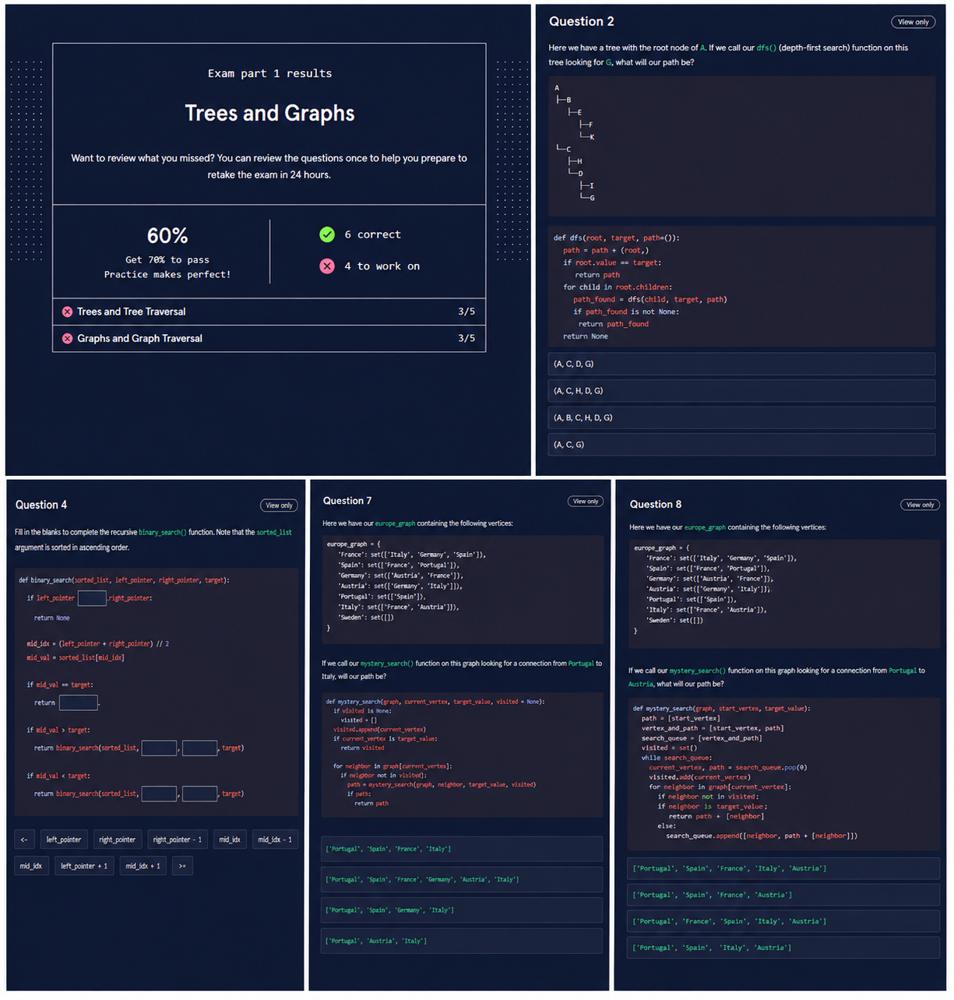
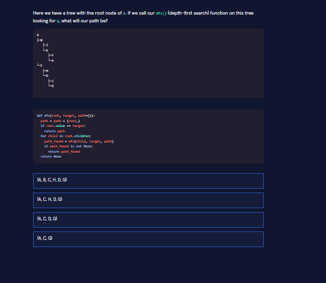
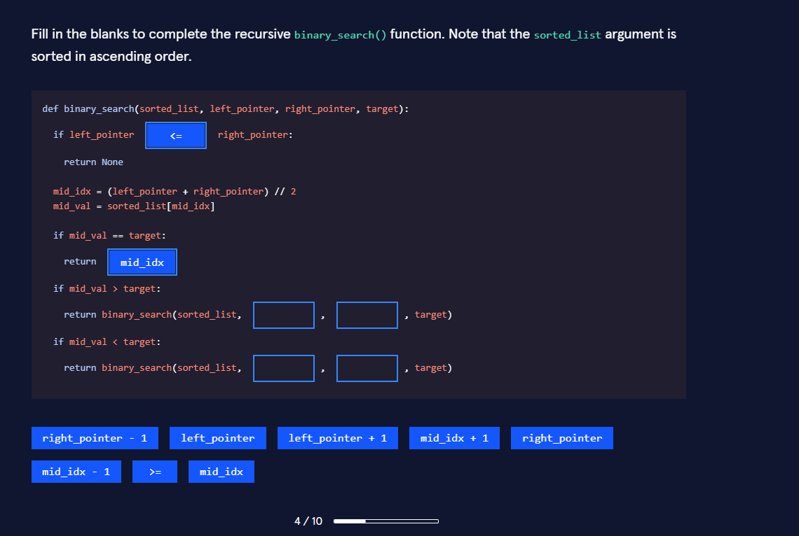
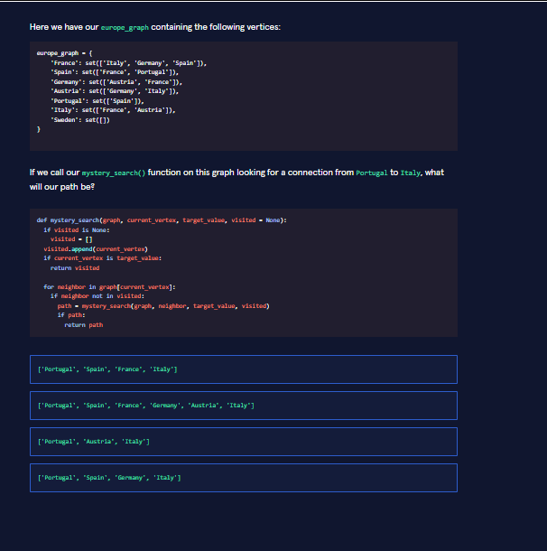
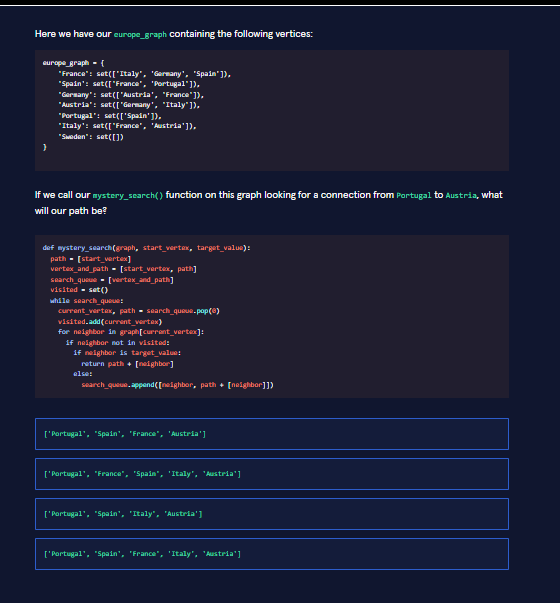

# 🌳 Trees & Graphs — Exam Part 1 (Attempt #1)

> Resultado del primer intento del examen (Codecademy)

---

## 📊 Resultado

- Score: **60%**
- Resultado: ❌ No aprobado
- Correctas: **6 / 10**

---

## 🧠 Contexto

Este examen forma parte del módulo **Trees and Graphs** dentro del path de Computer Science en Codecademy.

Se trata de una evaluación **teórica con aplicación práctica**, donde no alcanza con memorizar conceptos: es necesario interpretar correctamente la lógica de los algoritmos.

🏠 [Volver al repositorio principal](../../../README.md)

---

## ⚠️ Dificultad y Observaciones

El examen resultó más exigente de lo esperado.

Aunque los conceptos estaban estudiados (DFS, BFS, Binary Search, Dijkstra, A*), las preguntas requerían:

- Interpretar código en lugar de reconocer teoría
- Diferenciar recorrido vs camino (`visited` vs `path`)
- Entender el comportamiento real del algoritmo
- Detectar errores sutiles en condiciones

---

## ❌ Errores principales

- 🔁 Confusión entre DFS y BFS  
  - DFS → primer camino válido  
  - BFS → camino más corto  

- 🧩 Diferencia entre:
  - `visited` → nodos recorridos  
  - `path` → camino actual  

- 🔍 Interpretación incorrecta de código

- ⚠️ Casos borde en Binary Search

---

## 🧩 Preguntas del examen

Estas preguntas fueron clave para detectar errores de interpretación.

---

### 🌳 Question 2 — DFS Tree (Path)

---

### 🔍 Question 4 — Binary Search (Recursivo)

---

### 🌐 Question 7 — DFS Graph (Path)

---

### ⚡ Question 8 — BFS Graph (Shortest Path)

---

## 📌 Conceptos cubiertos

- 🌳 Trees (estructuras jerárquicas)
- 🌐 Graphs (relaciones entre nodos)
- 🔁 DFS (Depth First Search)
- 📊 BFS (Breadth First Search)
- 🔍 Binary Search
- 💰 Dijkstra (shortest path con pesos)
- ⭐ A* (heurísticas de búsqueda)

---

## 🎯 Plan de mejora

Para el próximo intento:

- Reforzar DFS vs BFS en código
- Practicar interpretación paso a paso
- Repasar casos límite (Binary Search)
- Resolver ejercicios similares

---

## 🛠️ Corrección detallada de ejercicios

Para ver el análisis completo de cada pregunta:

- 🌳 [Q2 — DFS Tree](./corrections/q2-dfs-tree.md)
- 🔍 [Q4 — Binary Search](./corrections/q4-binary-search.md)
- 🌐 [Q7 — DFS Graph](./corrections/q7-dfs-graph.md)
- ⚡ [Q8 — BFS Graph](./corrections/q8-bfs-graph.md)

