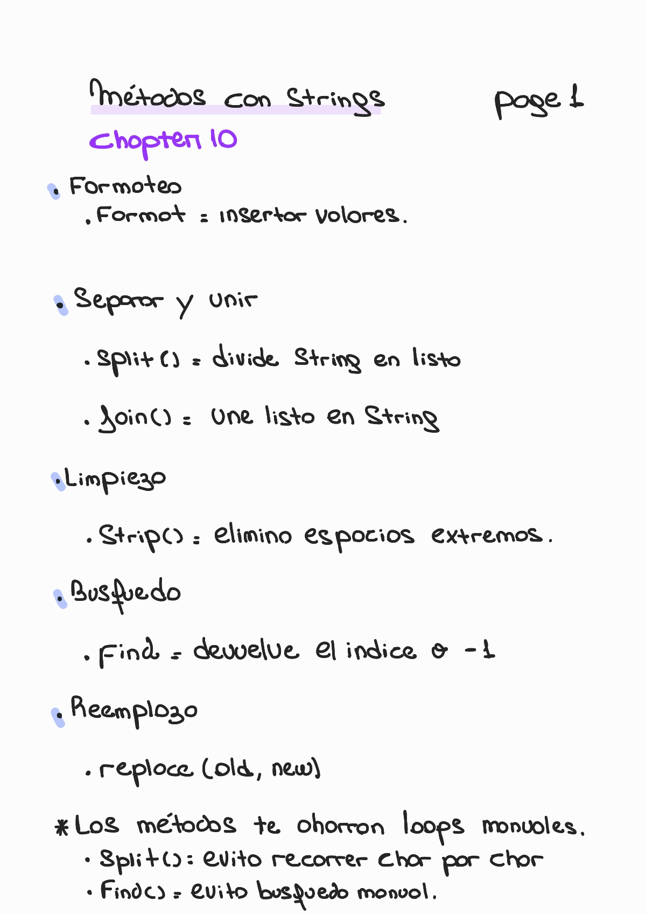
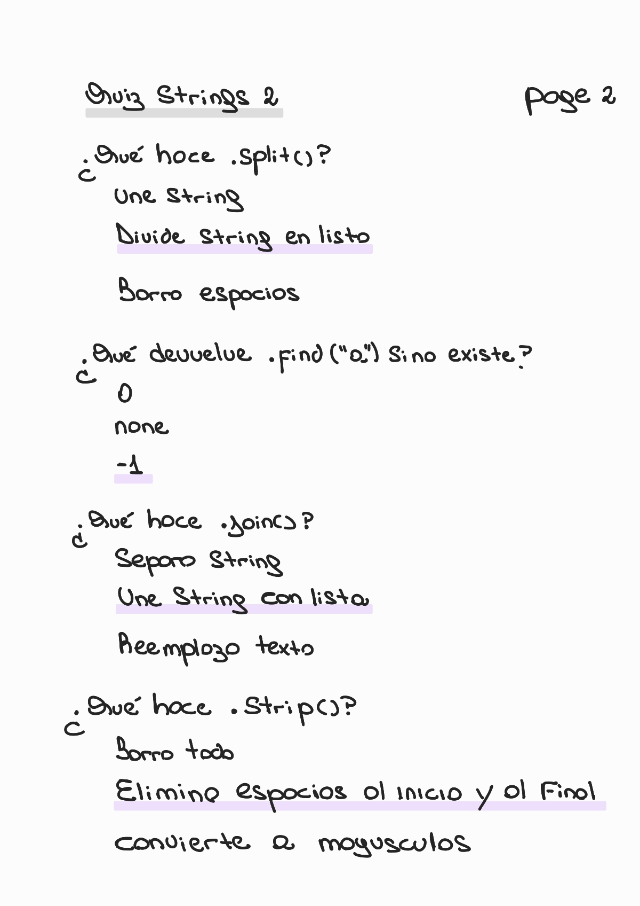
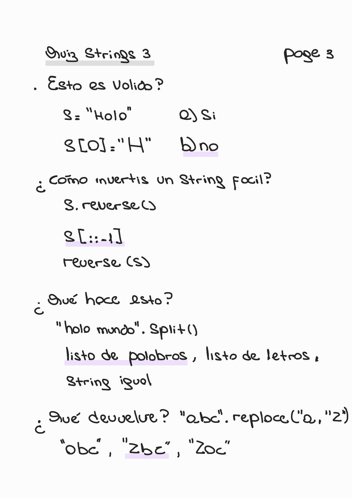
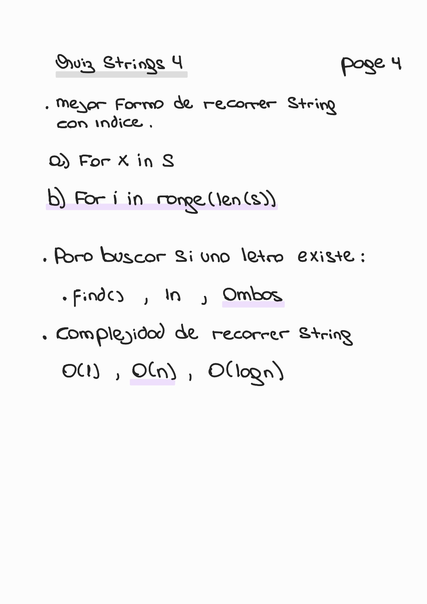

# Chapter 10 — String Methods

🏠 [Volver al repositorio principal](../../README.md)

⬅️ [Capítulo anterior — Strings](../chapter9_strings/README.md)

➡️ [Capítulo siguiente — Modules](../chapter11_modules/README.md)

💻 [Ver ejemplos prácticos](../../code_examples/chapter10/README.md)

---

## 📌 Contenido del capítulo

- Métodos de strings
- Formateo
- split()
- join()
- strip()
- find()
- replace()
- Quiz

---

## 🔧 Métodos de Strings (Page 1)

  

---

## 🧠 Quiz — String Methods (Page 2)

  

---

## 🧠 Quiz — Aplicación (Page 3)

  

---

## 🧠 Quiz — DSA (Page 4)

  

---
