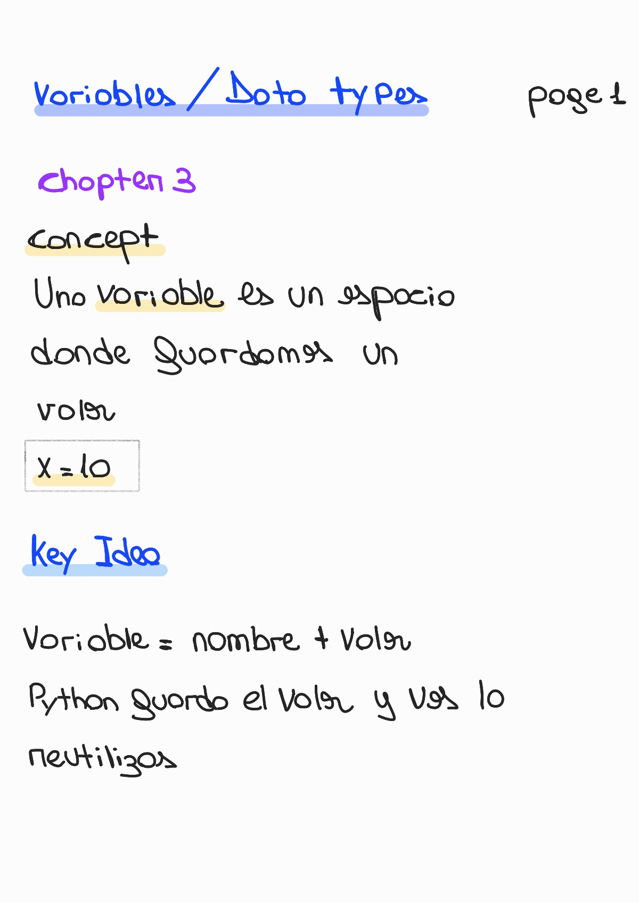

# Chapter 3 — Variables and Data Types

🏠 [Volver al repositorio principal](../../README.md)

⬅️ [Capítulo anterior — Control Flow](../chapter2_control_flow/README.md)

➡️ [Capítulo siguiente — Lists](../chapter4_lists/README.md)

💻 [Ver ejemplos prácticos](../../code_examples/chapter3/README.md)

---

## 🧩 Contenido del capítulo
- Concepto de variable
- Reglas de nombres
- Tipos de datos
- type() y casting
---

## Variables and Data Types

### 🧠 Concept & Key Idea

  

---

### 🏷️ Crear Variables & Reglas

  

---

### 🔢 Tipos de Datos

  

---

### 🔍 type() y Casting

  

