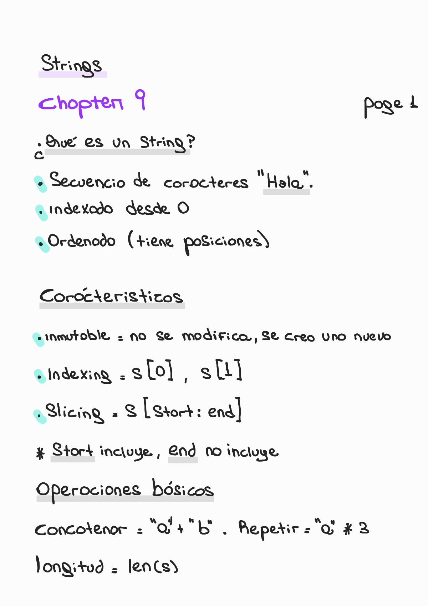
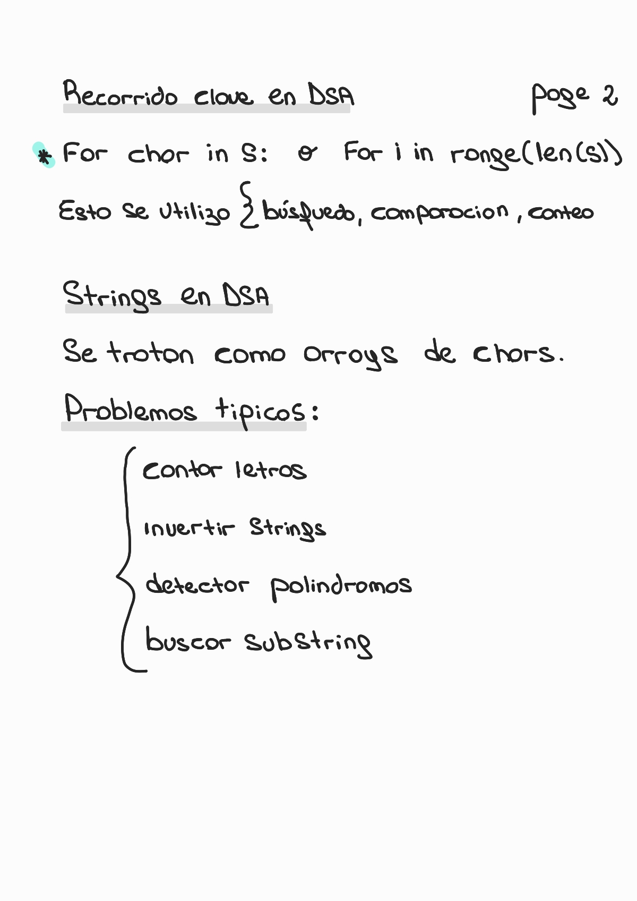
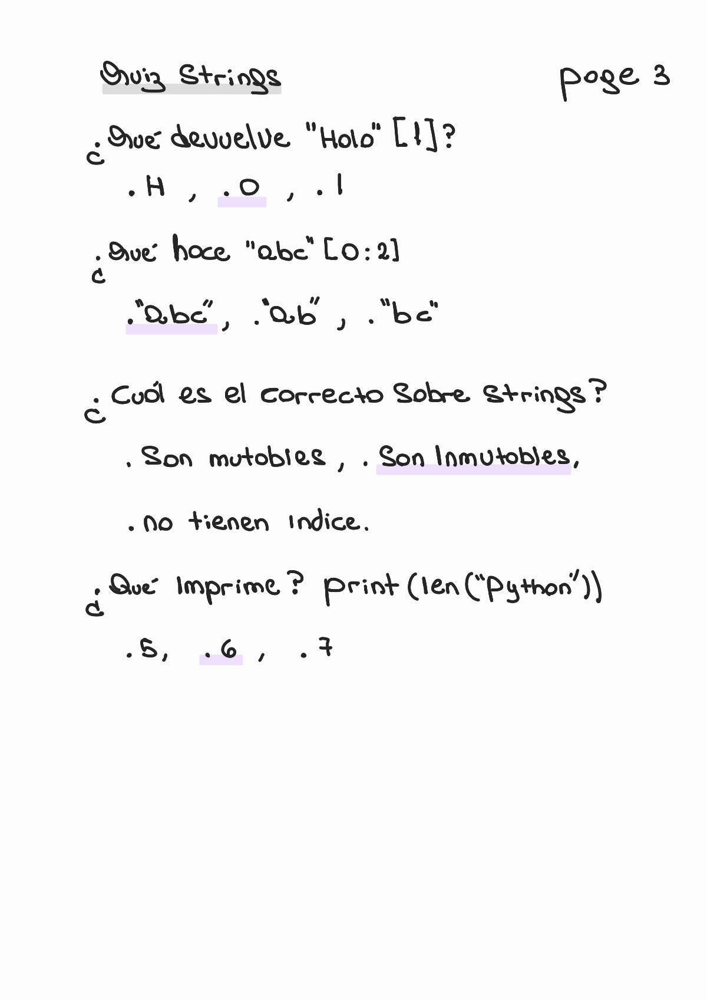

# Chapter 9 — Strings

🏠 [Volver al repositorio principal](../../README.md)

⬅️ [Capítulo anterior — Git & Version Control](../chapter8_git/README.md)

➡️ [Capítulo siguiente — String Methods](../chapter10_string_methods/README.md)

💻 [Ver ejemplos prácticos](../../code_examples/chapter9/README.md)

---

## 📌 Contenido del capítulo

- ¿Qué es un string?
- Características principales
- Indexing
- Slicing
- Operaciones básicas
- Recorrido en DSA
- Strings en DSA
- Quiz

---

## 🧠 Teoría — Strings (Page 1)

  

---

## 🔁 Strings en DSA (Page 2)

  

---

## 🧠 Quiz — Strings (Page 3)

  

---
