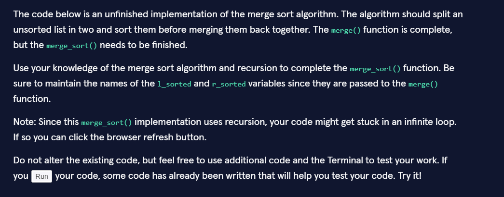
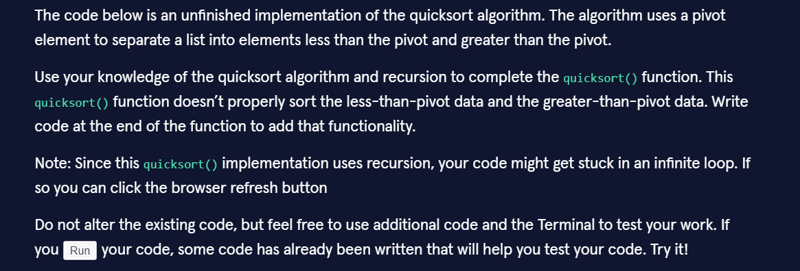
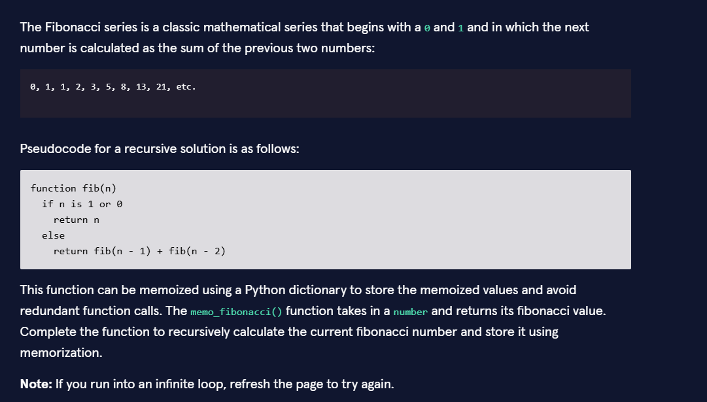

# 🧠 Algorithms – Examen Codecademy

Este módulo contiene la resolución práctica del examen de algoritmos de Codecademy.

🔙 [Volver a Codecademy](../README.md)  

🏠 [Volver al repositorio principal](../../../README.md)

---

## 📊 Resultados

- 📝 Parte teórica: 75%
- 💻 Parte práctica: 100%

---

## 🚀 Algoritmos implementados

- 🔀 **Merge Sort**
- ⚡ **Quick Sort**
- 🔢 **Fibonacci con Memoization**

---

## 📚 Detalle de ejercicios

| Nº | Tema | Enunciado | Código |
|---|---|---|---|
| 1 | 🔀 Merge Sort | [Ver enunciado](images/01_Ejercicio_MergeSort.png) | [Abrir código](merge_sort.py) |
| 2 | ⚡ Quick Sort | [Ver enunciado](images/02_Ejercicio_QuickSort.png) | [Abrir código](quick_sort.py) |
| 3 | 🔢 Fibonacci | [Ver enunciado](images/03_Ejercicio_Fibonacci.png) | [Abrir código](memo_fibonacci.py) |

---

## 🖼️ Enunciados del examen

👉 Las siguientes capturas muestran los enunciados de cada ejercicio.

### 🔀 Merge Sort

  

---

### ⚡ Quick Sort

  

---

### 🔢 Fibonacci

  

---

## 🧩 Conceptos aplicados

- 🔁 Recursión  
- 🧠 Divide and Conquer  
- ⚙️ Dynamic Programming  
- 📊 Complejidad temporal (Big-O)  

---

## 📈 Complejidades

- Merge Sort → `O(n log n)`  
- Quick Sort → `O(n log n)` promedio / `O(n²)` peor caso  
- Fibonacci (memoization) → `O(n)`  

---

## 💡 Reflexión

> La teoría puede ser confusa o engañosa en algunos casos.  
> La práctica se resuelve correctamente entendiendo los conceptos fundamentales.

---

## 📂 Archivos

- `merge_sort.py`
- `quick_sort.py`
- `memo_fibonacci.py`

---

✨ Este módulo representa una base sólida en algoritmos y resolución de problemas.
