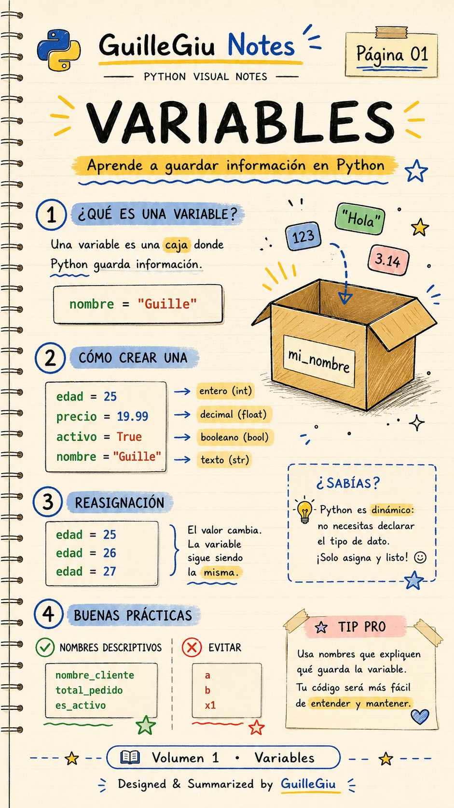
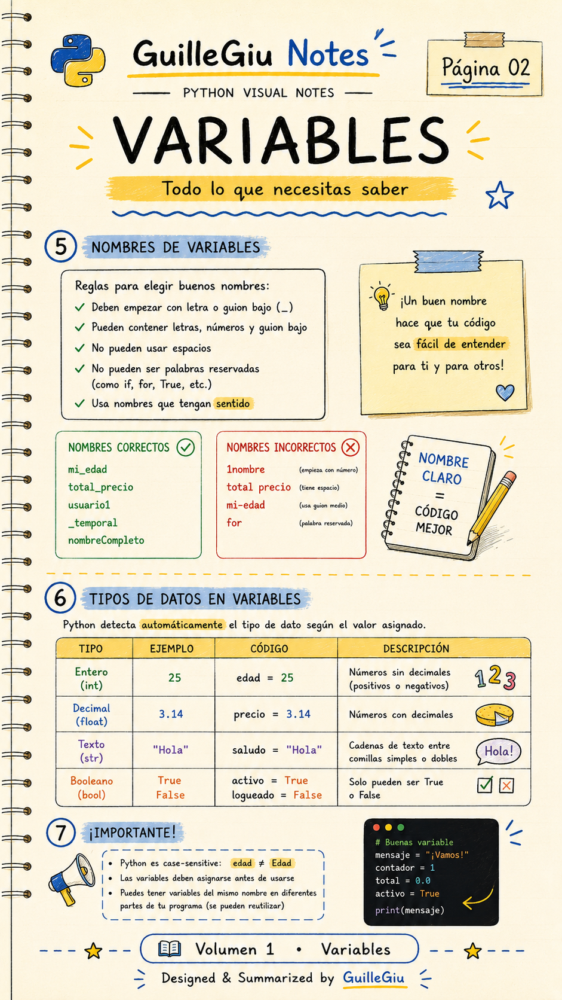
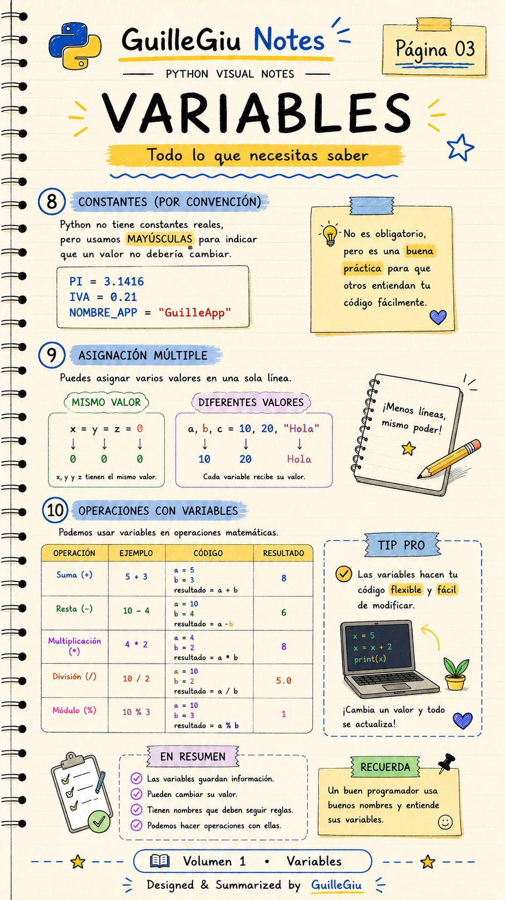
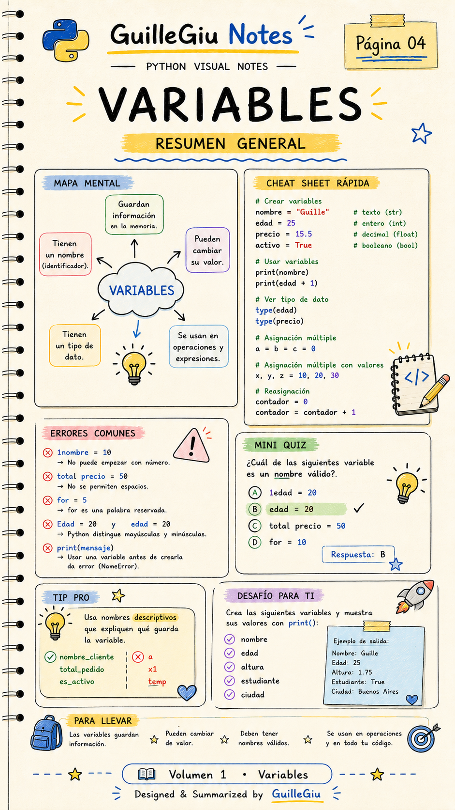

# 🐍 Volumen 01 · Variables

> Introducción a las variables en Python: creación, asignación de valores, nombres válidos y buenas prácticas.

---

  

  

  

  

---

  ⬅️ <a href="../README.md">Volver a Python</a>
  &nbsp; • &nbsp;
  <a href="../volumen_02_tipos_de_datos/">Volumen 02 · Tipos de Datos</a> ➡️

