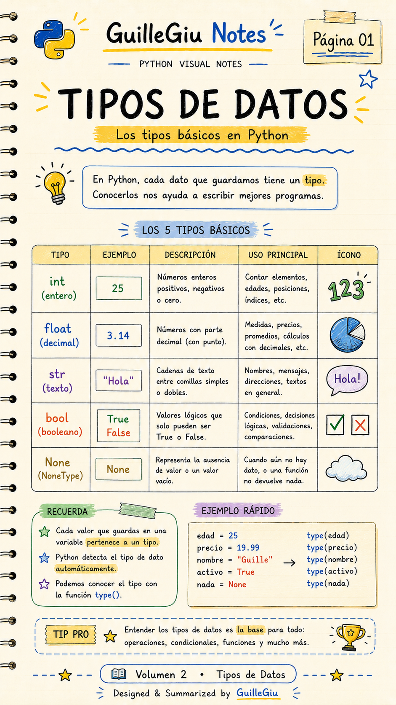
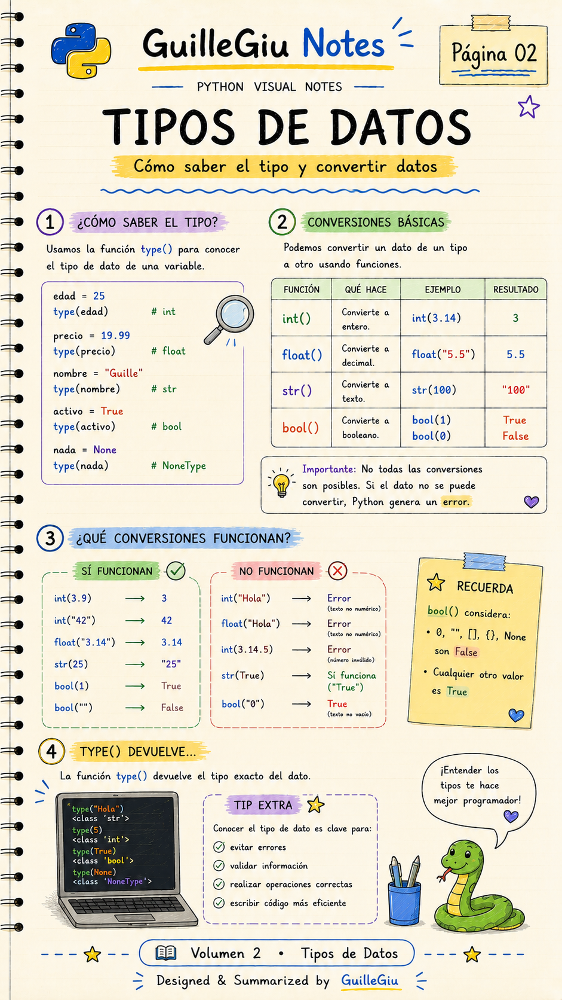
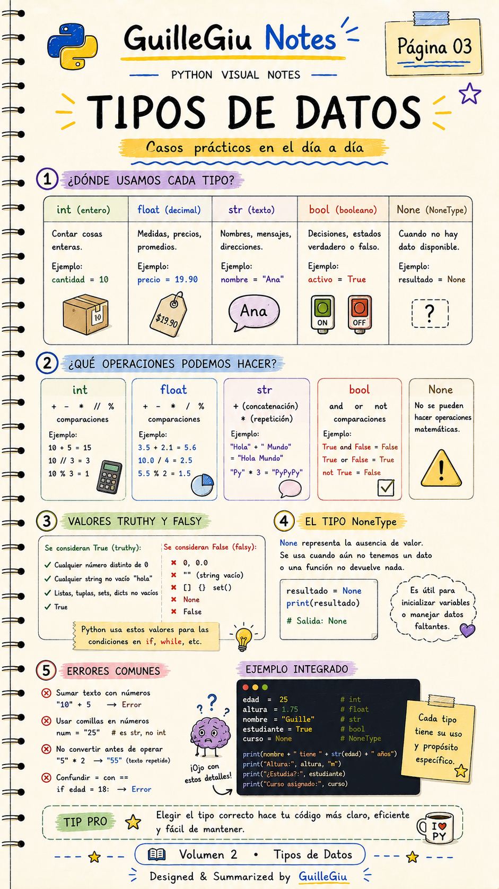
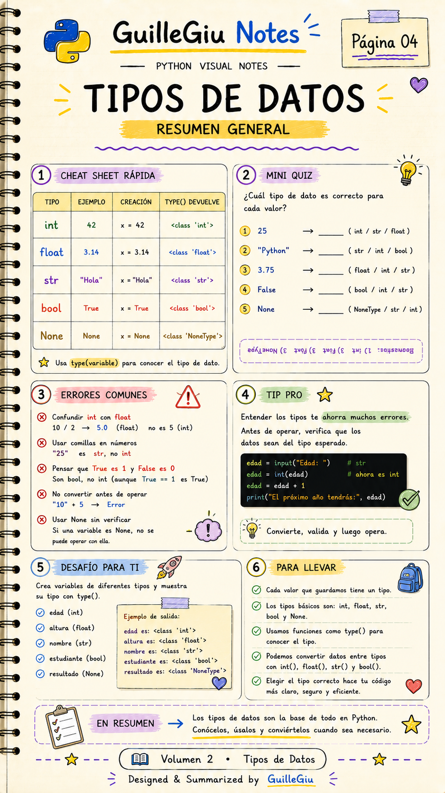

# 🐍 Volumen 02 · Tipos de Datos

> Conocé los tipos de datos fundamentales de Python y aprendé cuándo utilizar cada uno.

---

  

  

  

  

---

  ⬅️ <a href="../volumen_01_variables/">Volumen 01 · Variables</a>
  &nbsp; • &nbsp;
  <a href="../volumen_03_casting/">Volumen 03 · Casting</a> ➡️

