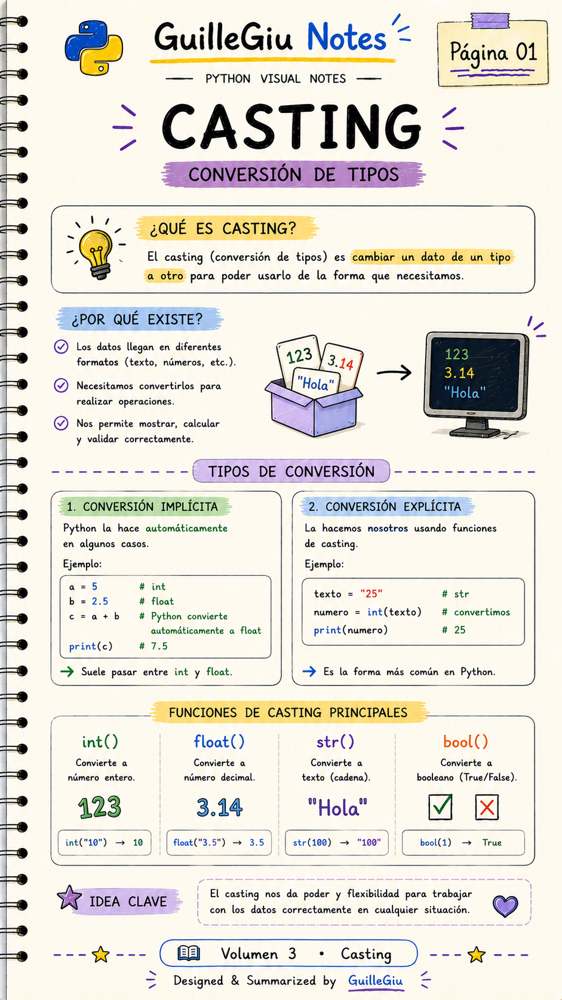
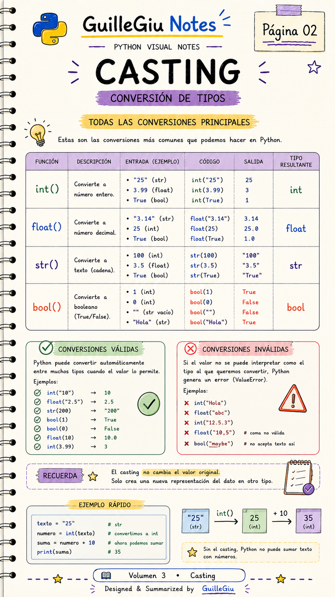
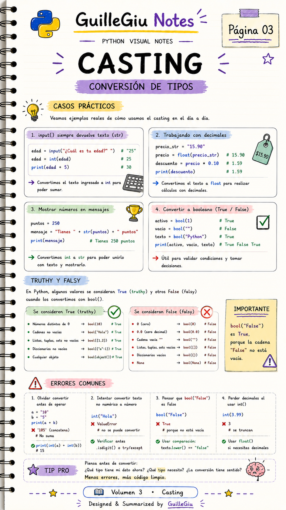
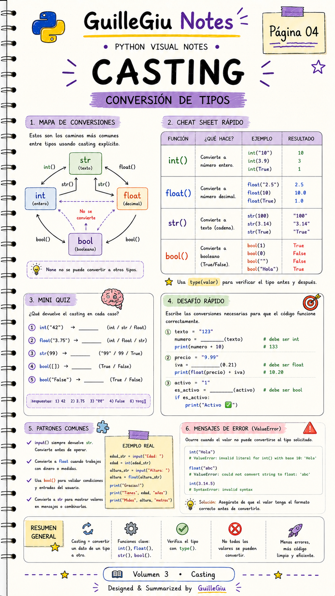

# 🐍 Volumen 03 · Casting

> Aprendé a convertir datos entre distintos tipos utilizando las funciones de casting de Python.

---

  

  

  

  

---

  ⬅️ <a href="../volumen_02_tipos_de_datos/">Volumen 02 · Tipos de Datos</a>
  &nbsp; • &nbsp;
  <a href="../volumen_04_entrada_salida/">Volumen 04 · Entrada y Salida</a> ➡️

