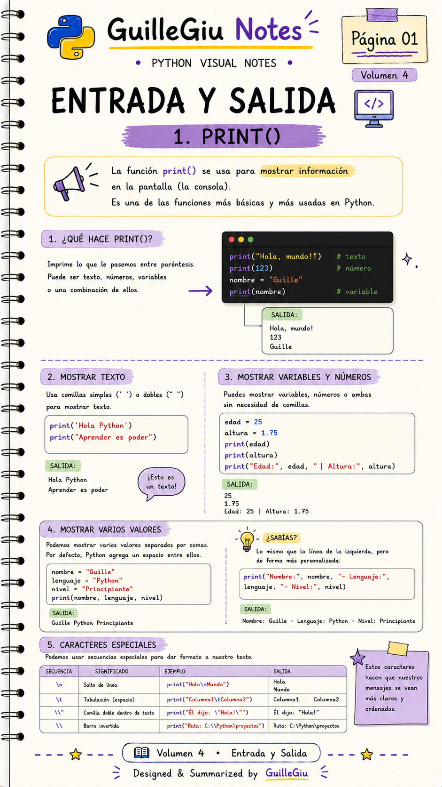
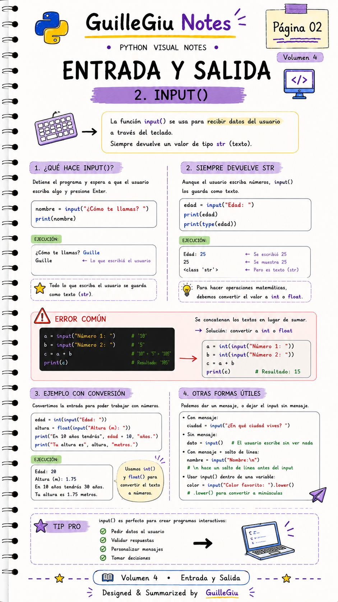
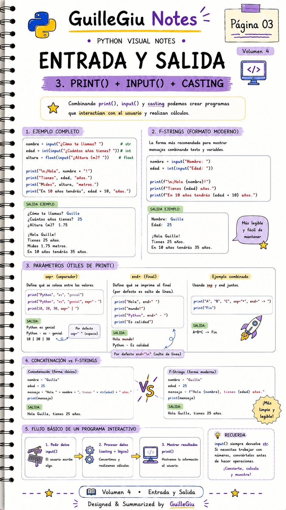
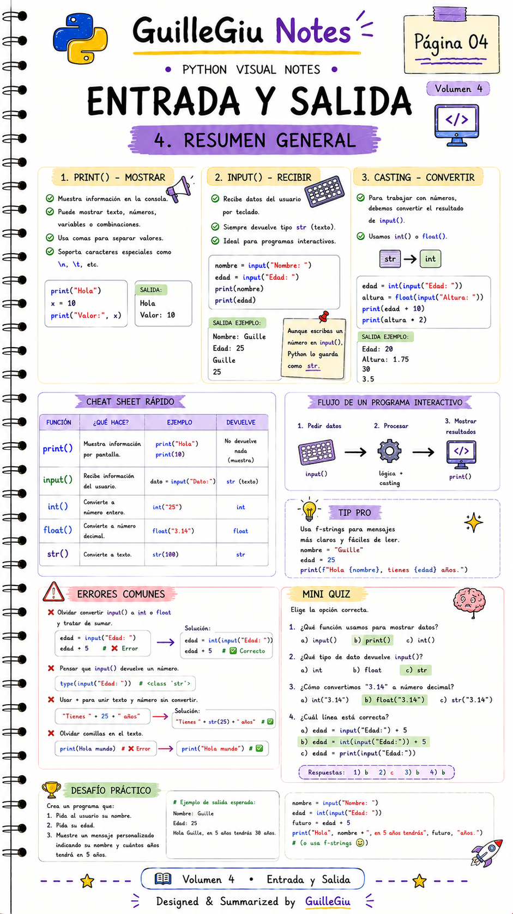

# 🐍 Volumen 04 · Entrada y Salida

> Aprendé a interactuar con el usuario utilizando `input()` y a mostrar información con `print()` en Python.

---

  

  

  

  

---

  ⬅️ <a href="../volumen_03_casting/">Volumen 03 · Casting</a>
  &nbsp; • &nbsp;
  <a href="../volumen_05_operadores/">Volumen 05 · Operadores</a> ➡️

