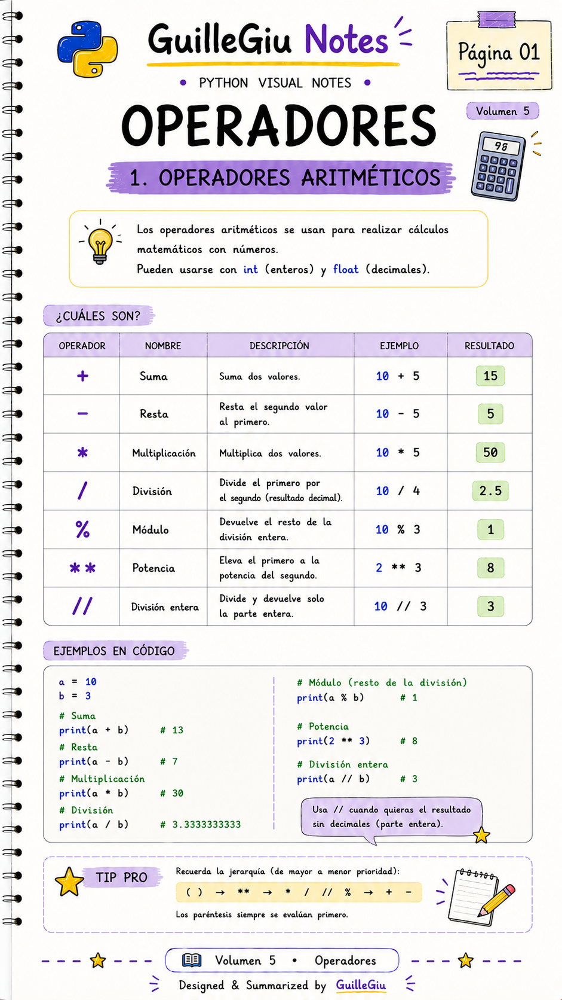
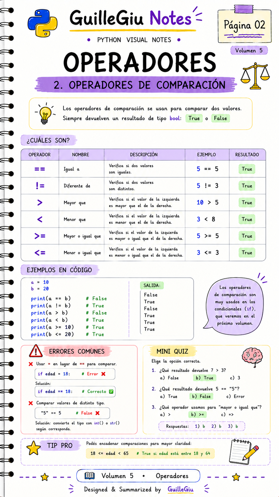
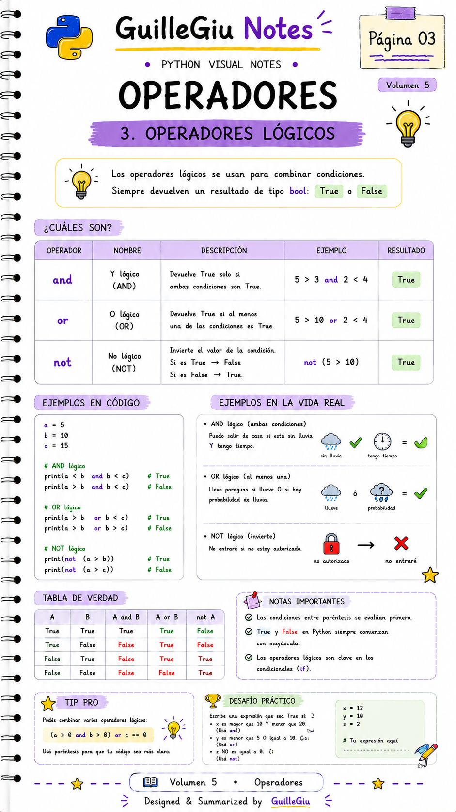
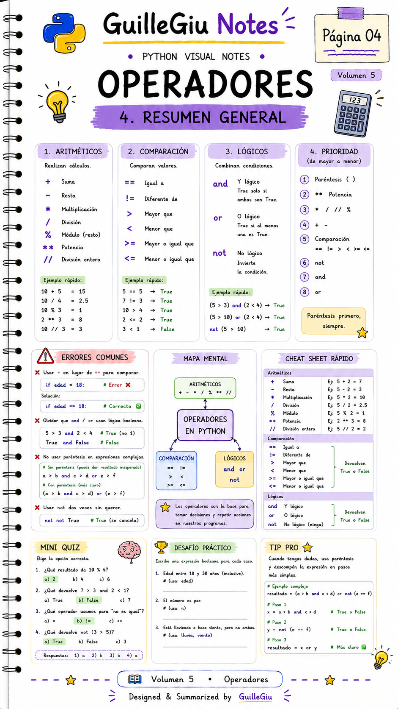

# 🐍 Volumen 05 · Operadores

> Descubrí cómo utilizar los operadores de Python para realizar cálculos, comparaciones y operaciones lógicas.

---

  

  

  

  

---

  ⬅️ <a href="../volumen_04_entrada_salida/">Volumen 04 · Entrada y Salida</a>
  &nbsp; • &nbsp;
  <a href="../volumen_06_condicionales/">Volumen 06 · Condicionales</a> ➡️

