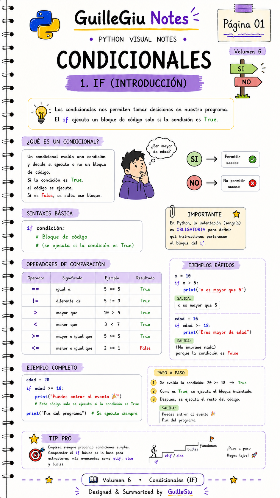
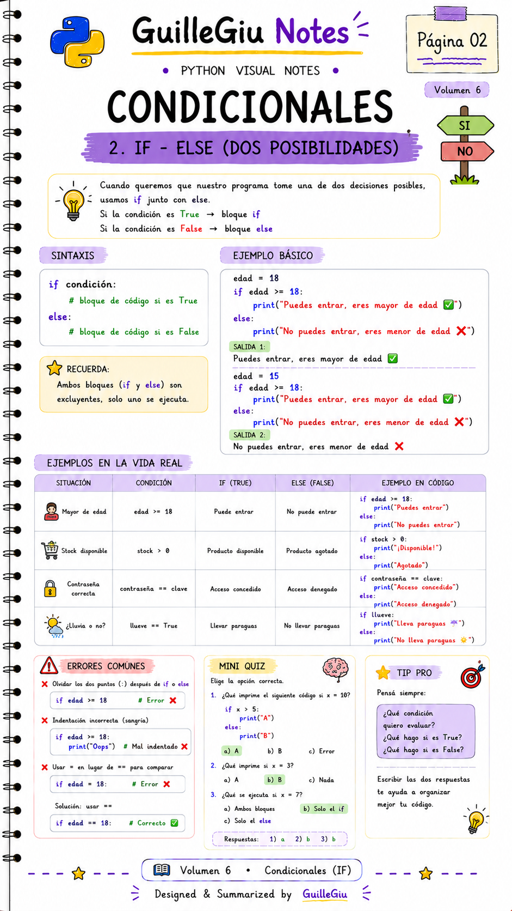
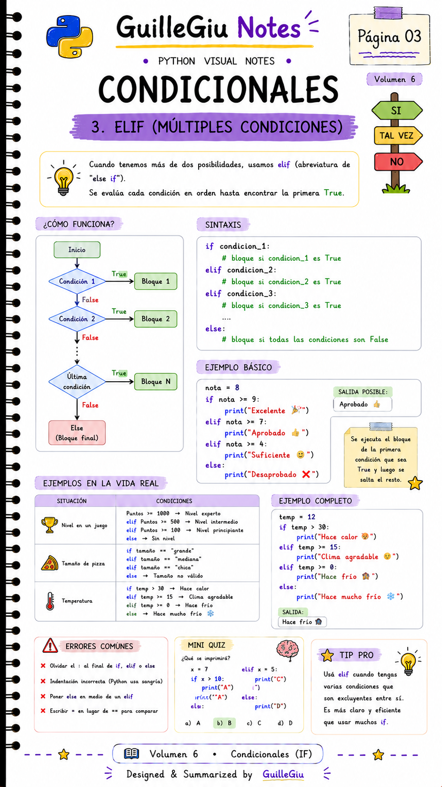
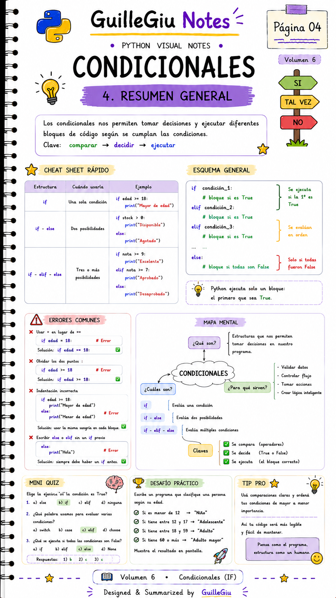

# 🐍 Volumen 06 · Condicionales

> Aprendé a controlar el flujo de un programa utilizando `if`, `elif` y `else` para tomar decisiones en Python.

---

  

  

  

  

---

  ⬅️ <a href="../volumen_05_operadores/">Volumen 05 · Operadores</a>
  &nbsp; • &nbsp;
  <a href="../volumen_07_bucles/">Volumen 07 · Bucles</a> ➡️

