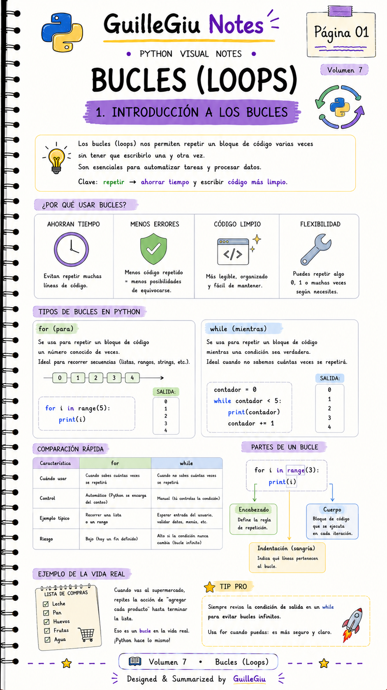
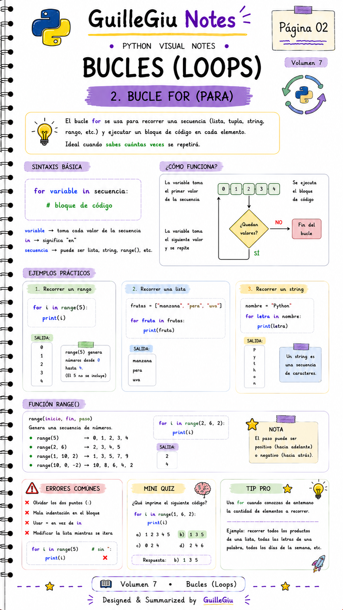
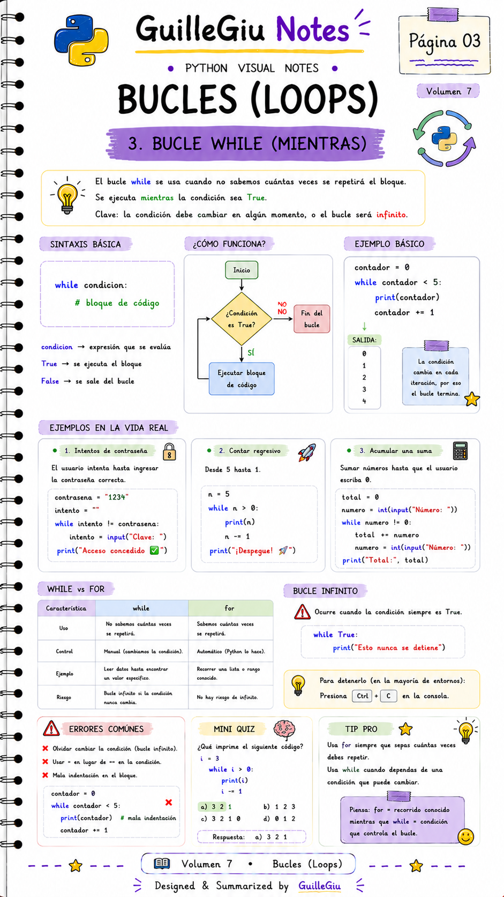
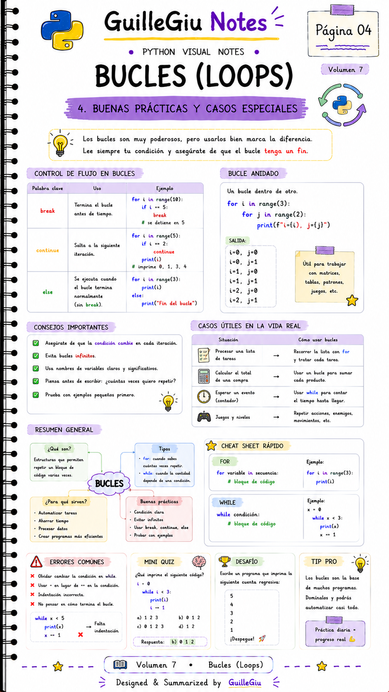
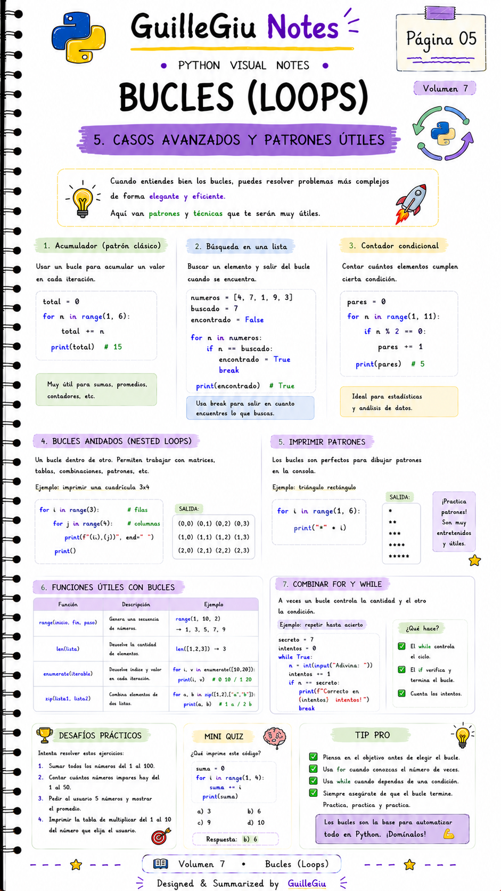

# 🐍 Volumen 07 · Bucles

> Aprendé a repetir tareas de forma eficiente utilizando los bucles `for` y `while` en Python.

---

  

  

  

  

  

---

  ⬅️ <a href="../volumen_06_condicionales/">Volumen 06 · Condicionales</a>
  &nbsp; • &nbsp;
  <a href="../volumen_08_funciones/">Volumen 08 · Funciones</a> ➡️

