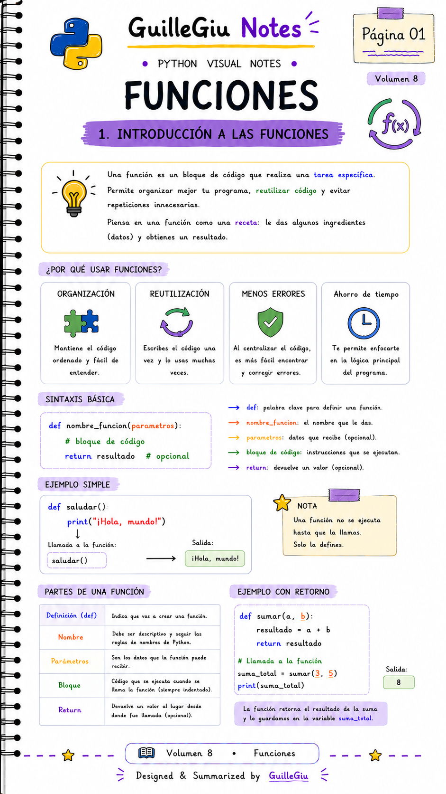
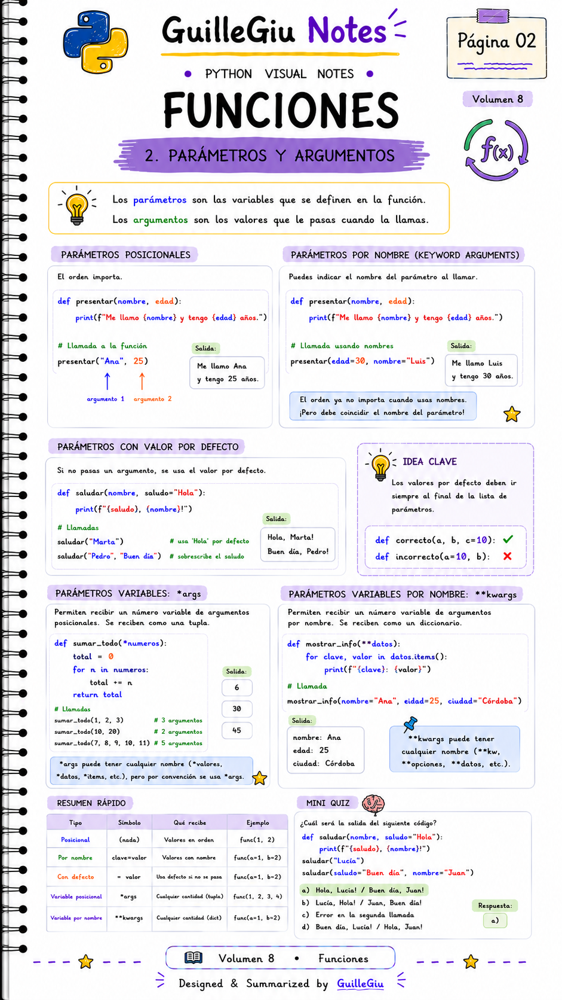
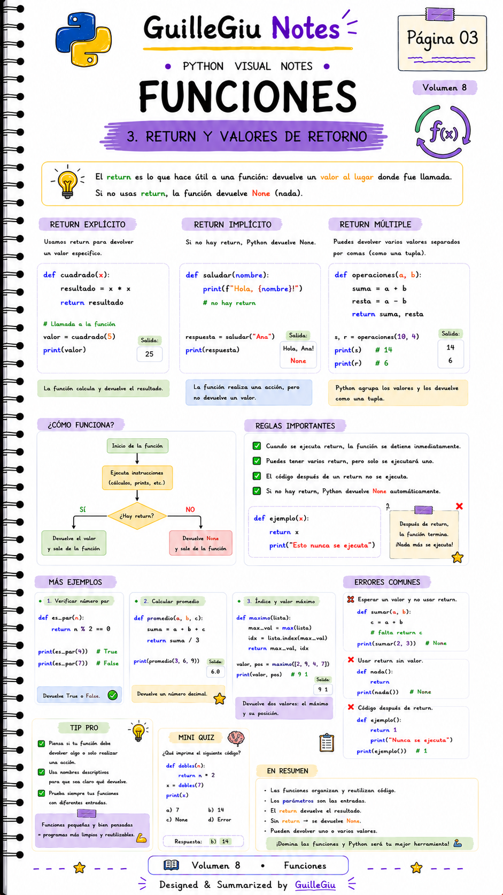
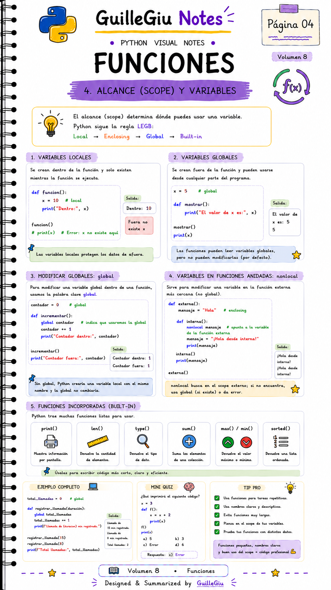
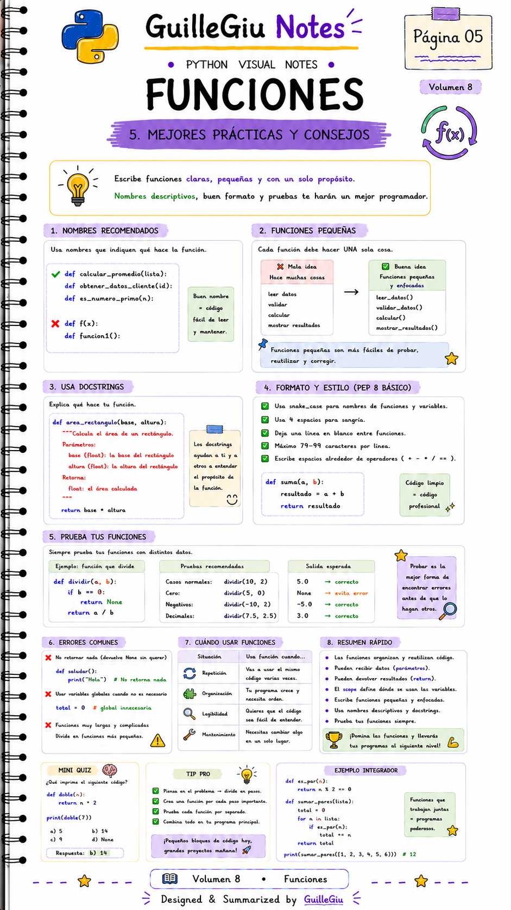

# 🐍 Volumen 08 · Funciones

> Aprendé a crear funciones reutilizables para organizar, simplificar y reutilizar tu código en Python.

---

  

  

  

  

  

---

  ⬅️ <a href="../volumen_07_bucles/">Volumen 07 · Bucles</a>
  &nbsp; • &nbsp;
  <a href="../volumen_09_listas/">Volumen 09 · Listas</a> ➡️

