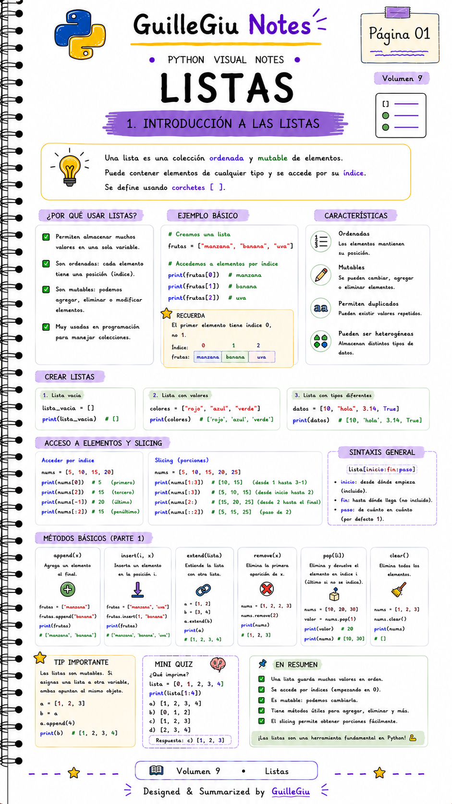
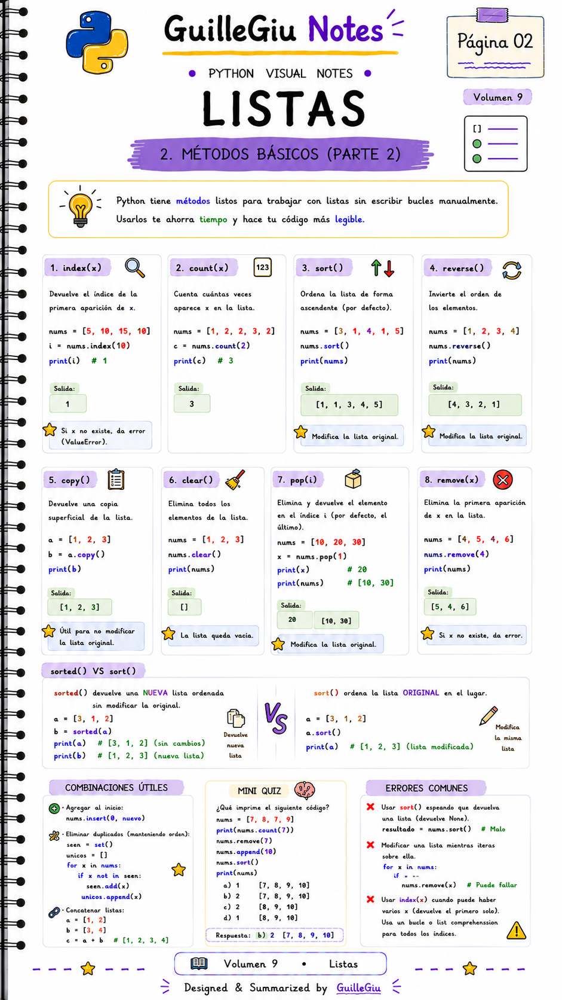
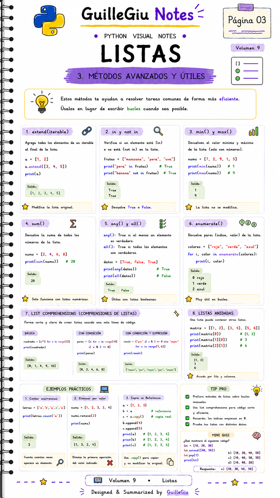
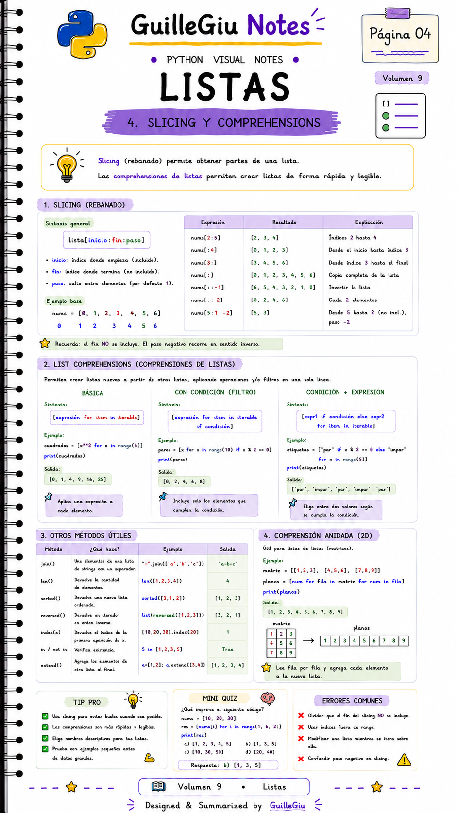
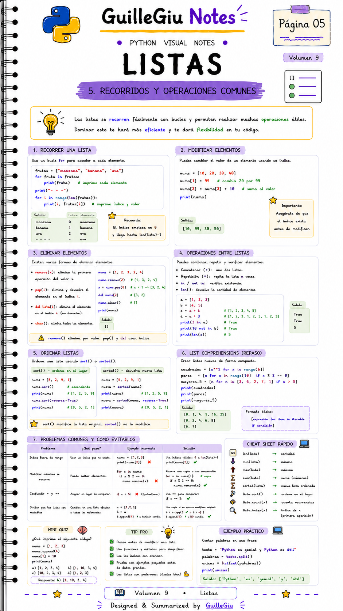
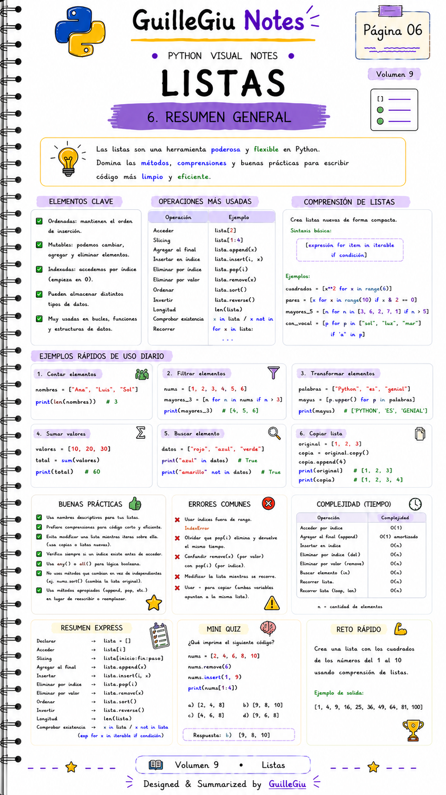

# 🐍 Volumen 09 · Listas

> Aprendé a crear, modificar y recorrer listas, una de las estructuras de datos más utilizadas en Python.

---

  

  

  

  

  

  

---

  ⬅️ <a href="../volumen_08_funciones/">Volumen 08 · Funciones</a>
  &nbsp; • &nbsp;
  <a href="../volumen_10_tuplas/">Volumen 10 · Tuplas</a> ➡️

