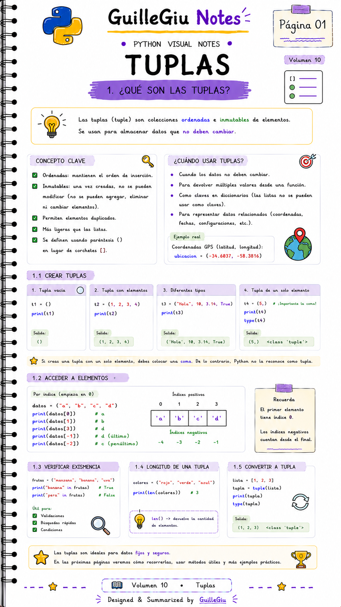
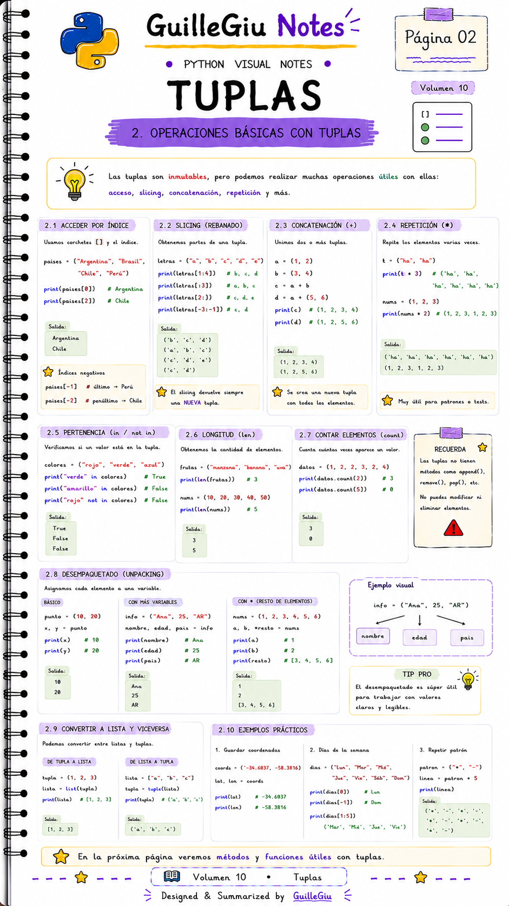
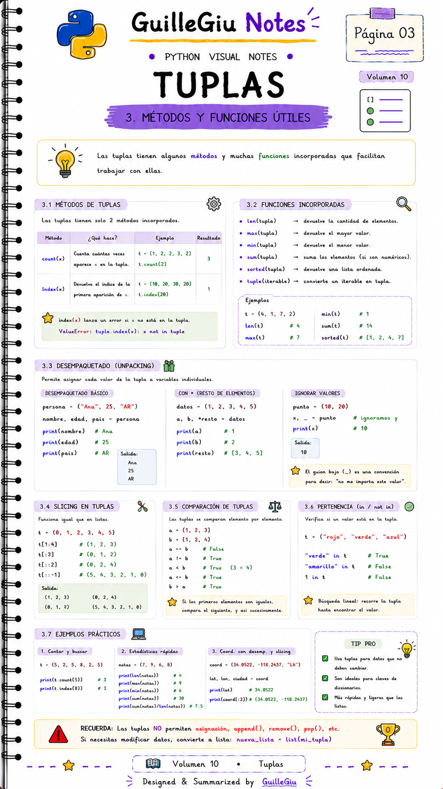
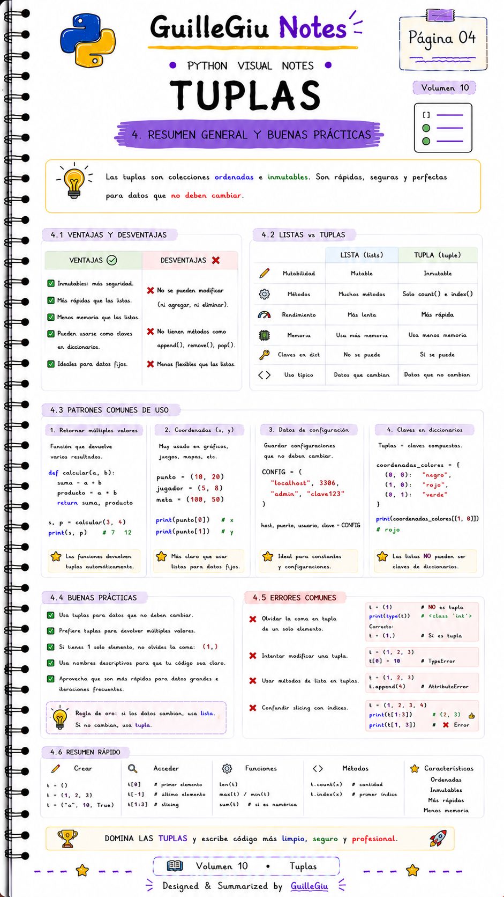

# 🐍 Volumen 10 · Tuplas

> Aprendé qué son las tuplas, cuándo utilizarlas y en qué se diferencian de las listas en Python.

---

  

  

  

  

---

  ⬅️ <a href="../volumen_09_listas/">Volumen 09 · Listas</a>
  &nbsp; • &nbsp;
  <a href="../volumen_11_diccionarios/">Volumen 11 · Diccionarios</a> ➡️

