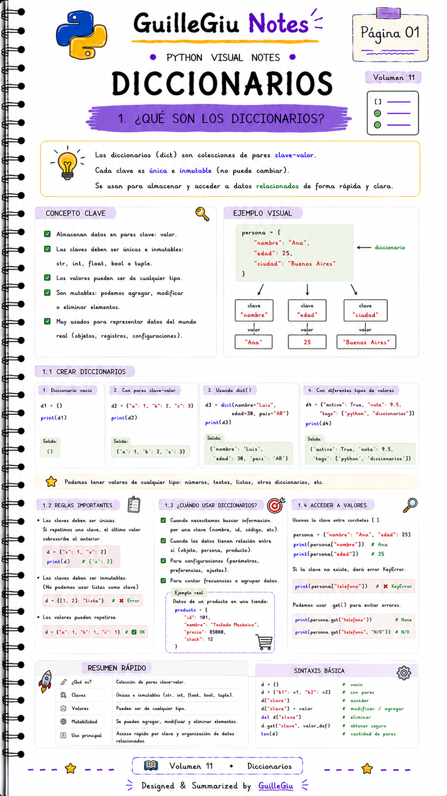
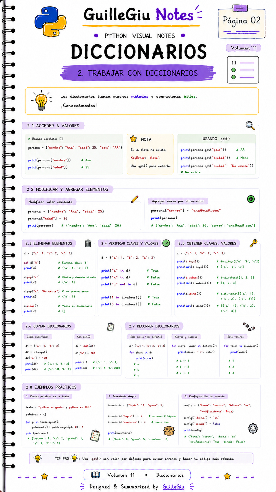
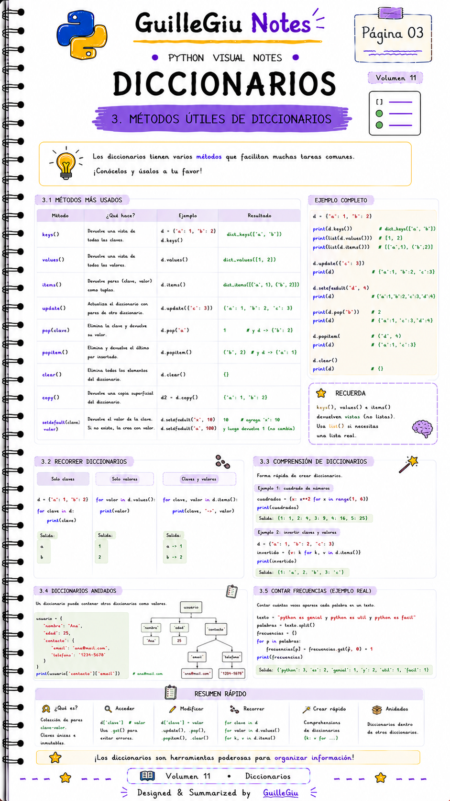
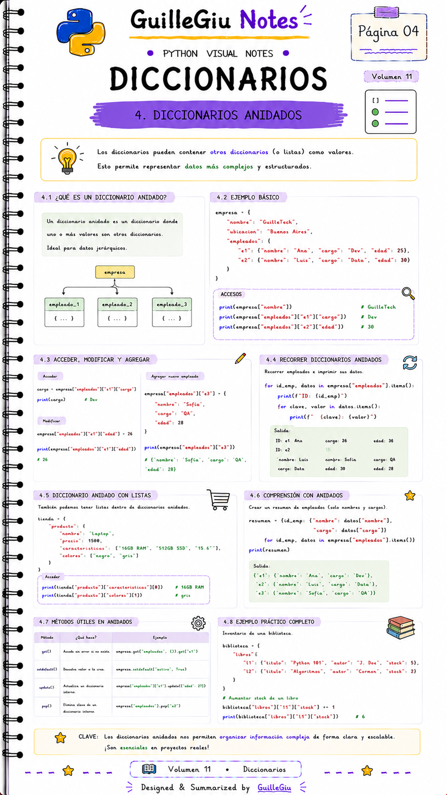
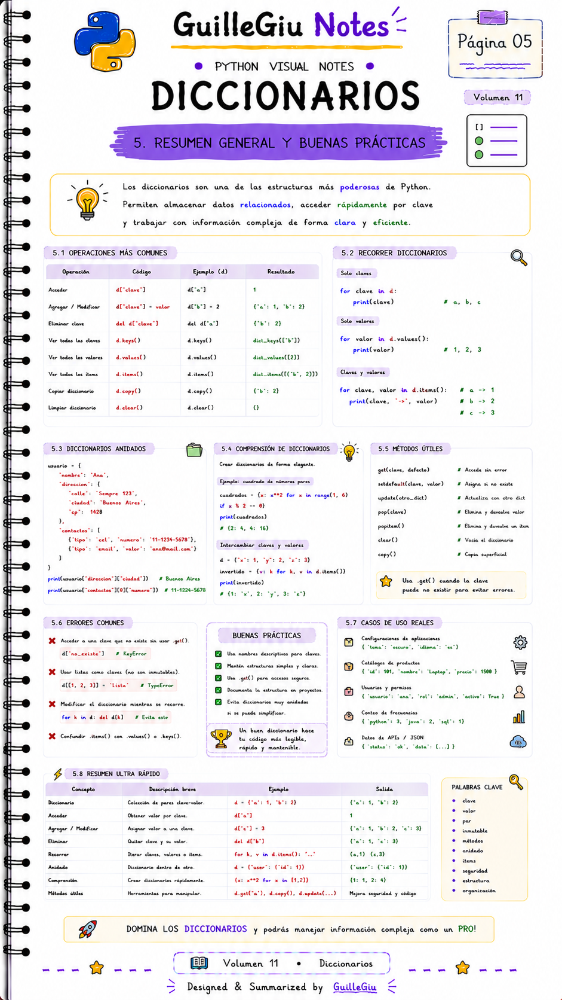

# 🐍 Volumen 11 · Diccionarios

> Aprendé a almacenar información utilizando pares **clave-valor** con los diccionarios, una de las estructuras más potentes de Python.

---

  

  

  

  

  

---

  ⬅️ <a href="../volumen_10_tuplas/">Volumen 10 · Tuplas</a>
  &nbsp; • &nbsp;
  <a href="../volumen_12_sets/">Volumen 12 · Sets</a> ➡️

