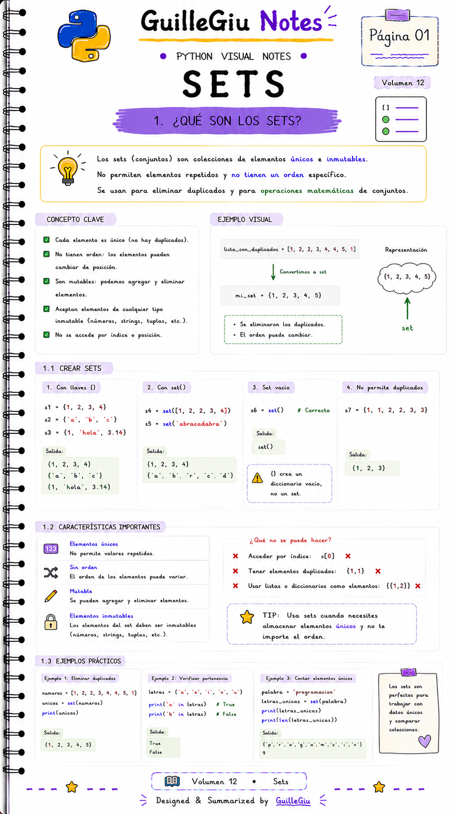
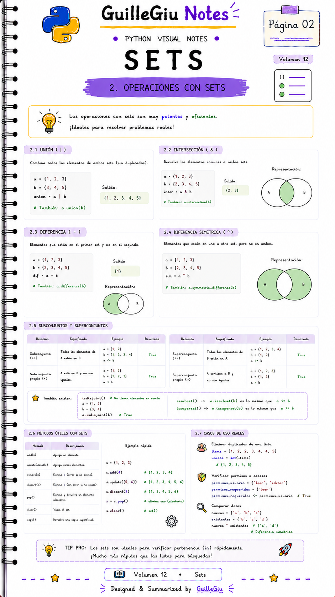
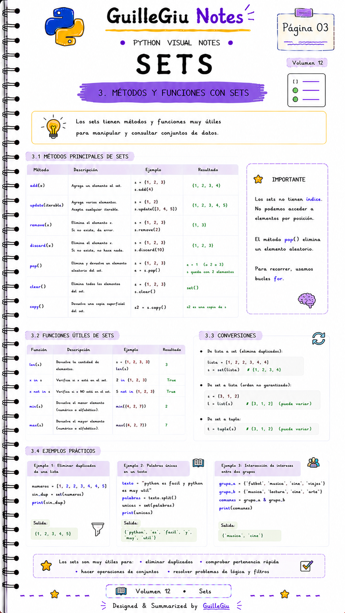
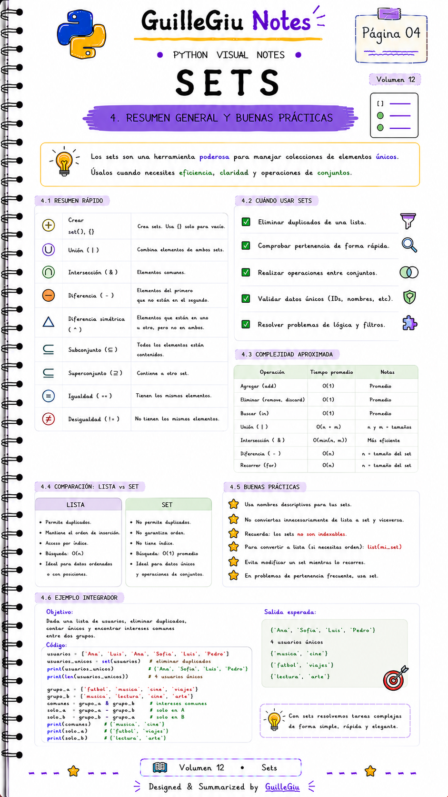

# 🐍 Volumen 12 · Sets

> Aprendé a utilizar los **sets** para almacenar elementos únicos y realizar operaciones de conjuntos de forma rápida y eficiente.

---

  

  

  

  

---

  ⬅️ <a href="../volumen_11_diccionarios/">Volumen 11 · Diccionarios</a>
  &nbsp; • &nbsp;
  <a href="../volumen_13_strings/">Volumen 13 · Strings</a> ➡️

