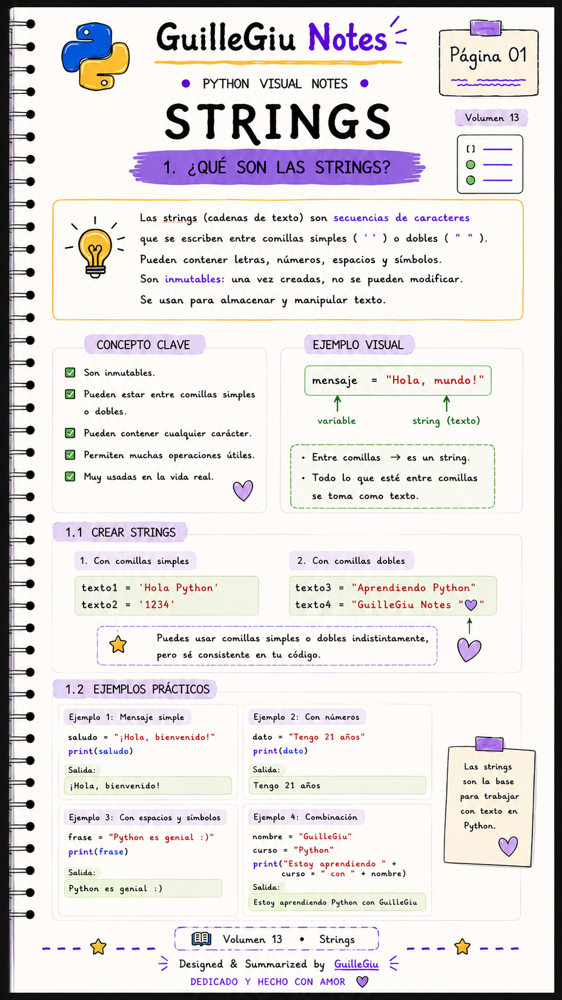
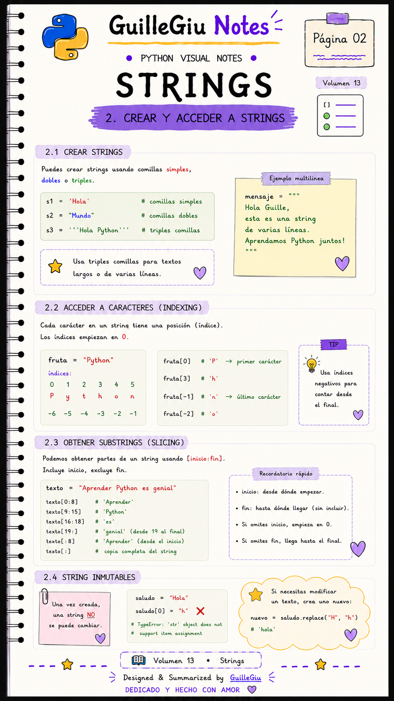
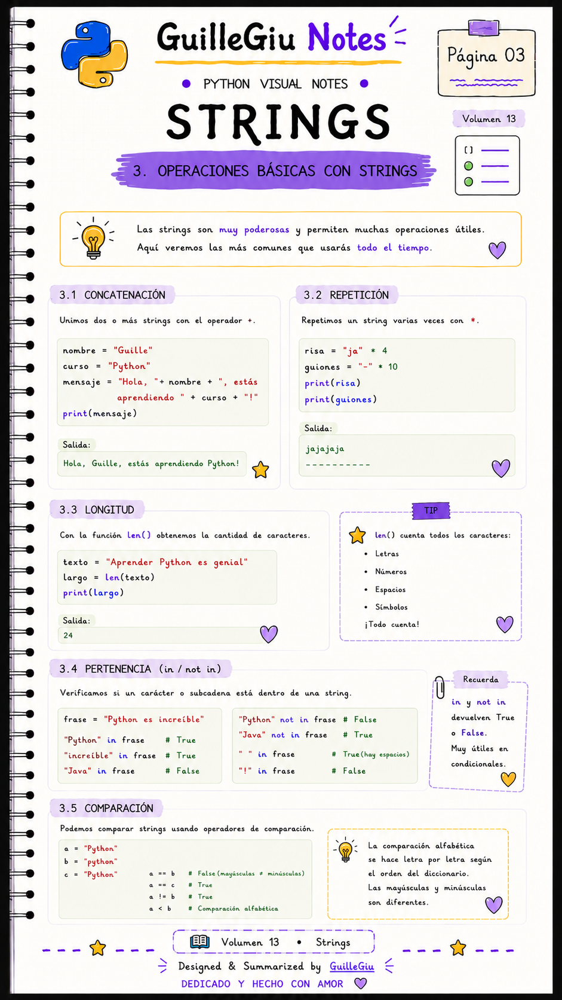
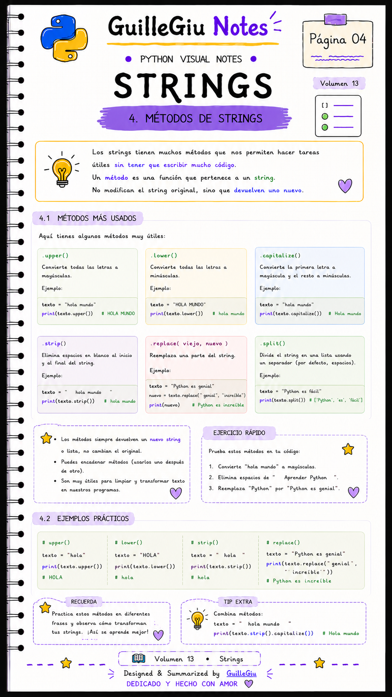
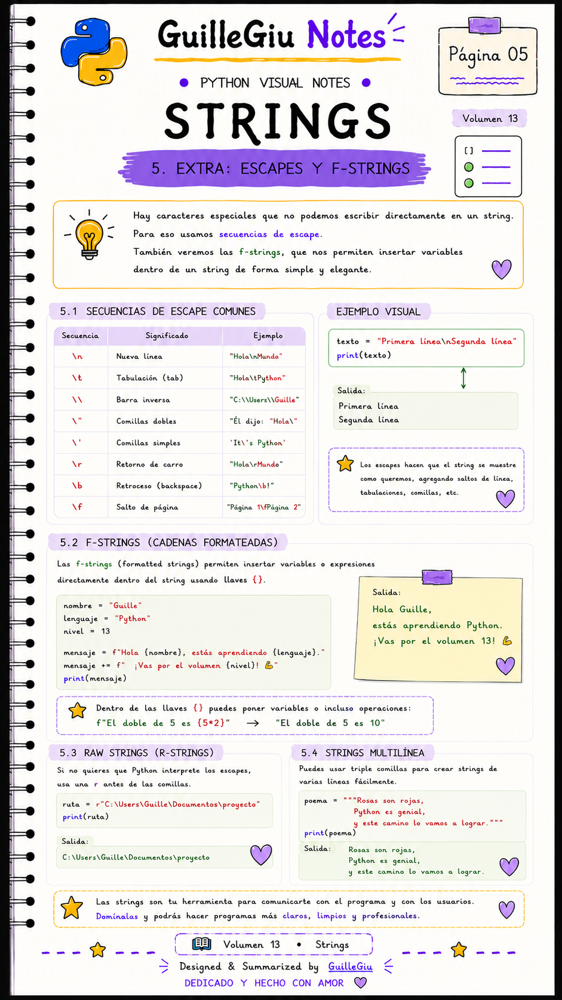

# 🐍 Volumen 13 · Strings

> Aprendé a trabajar con cadenas de texto, manipular caracteres y utilizar una de las estructuras más importantes de Python.

---

  

  

  

  

  

---

  ⬅️ <a href="../volumen_12_sets/">Volumen 12 · Sets</a>
  &nbsp; • &nbsp;
  <a href="../volumen_14_string_methods/">Volumen 14 · String Methods</a> ➡️

