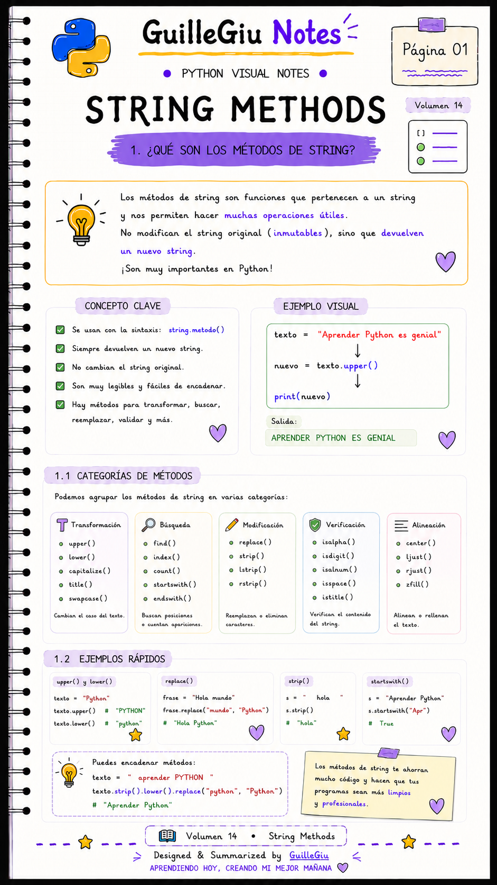
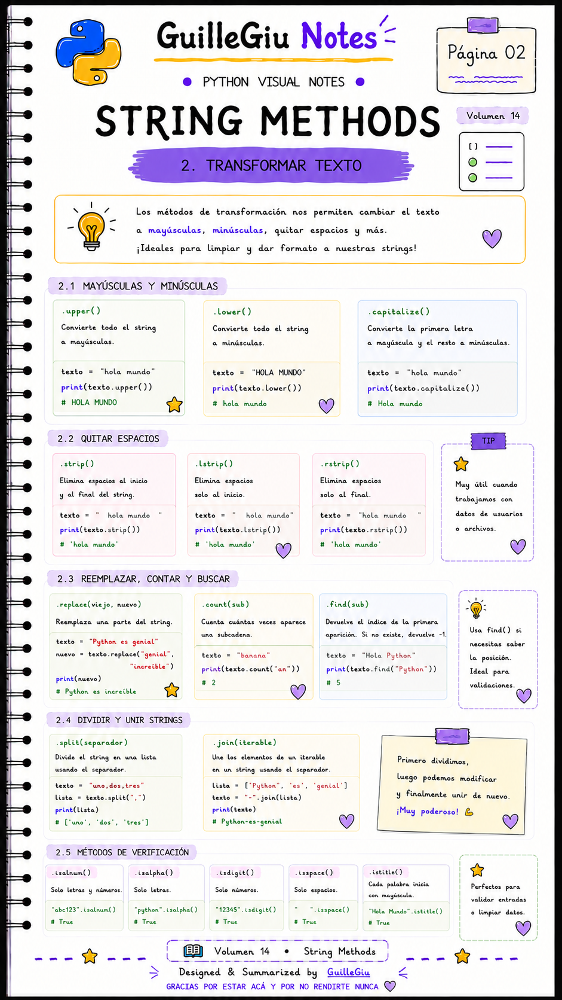
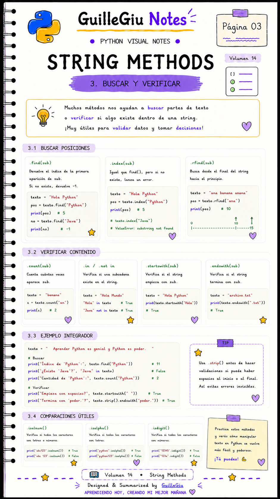
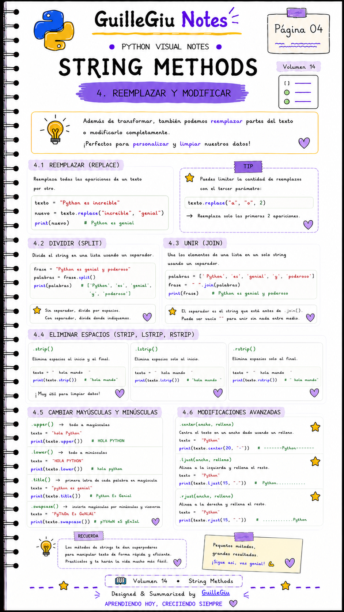
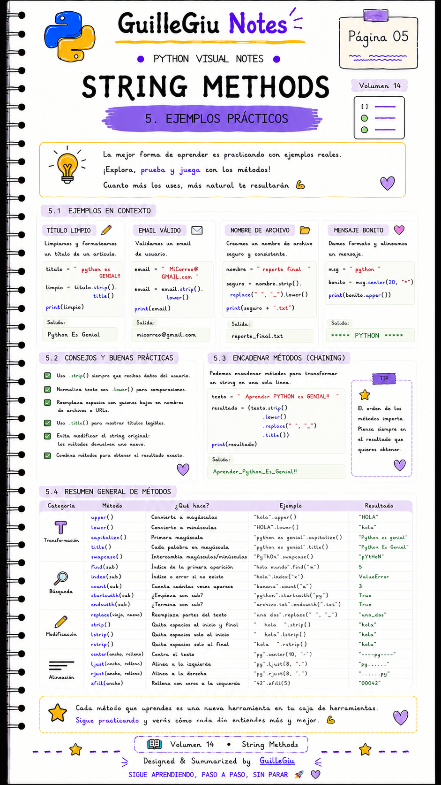

# 🐍 Volumen 14 · String Methods

> Aprendé a utilizar los métodos más importantes de las cadenas de texto para buscar, modificar, dividir y formatear información en Python.

---

  

  

  

  

  

---

  ⬅️ <a href="../volumen_13_strings/">Volumen 13 · Strings</a>
  &nbsp; • &nbsp;
  <a href="../volumen_15_booleanos/">Volumen 15 · Booleanos</a> ➡️

