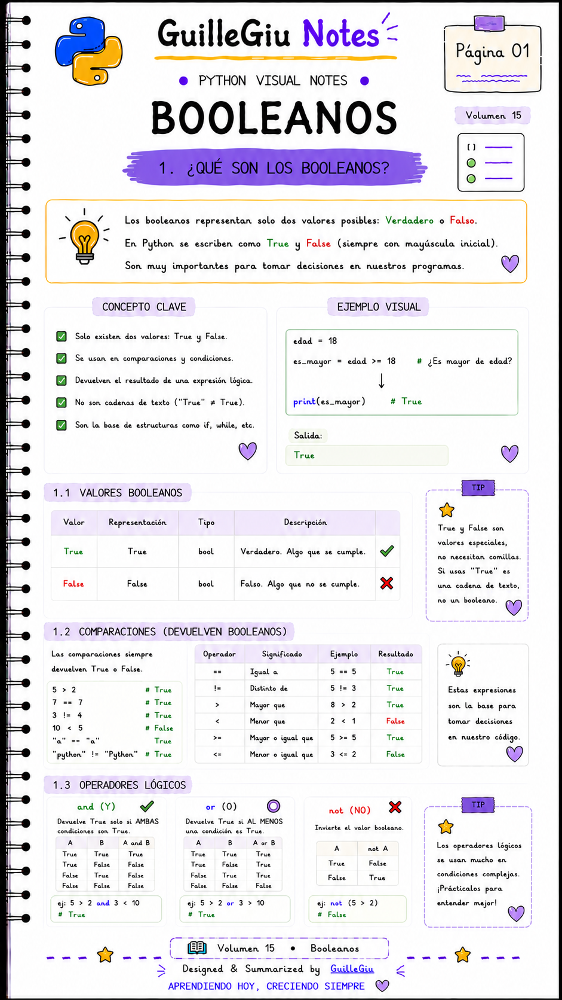
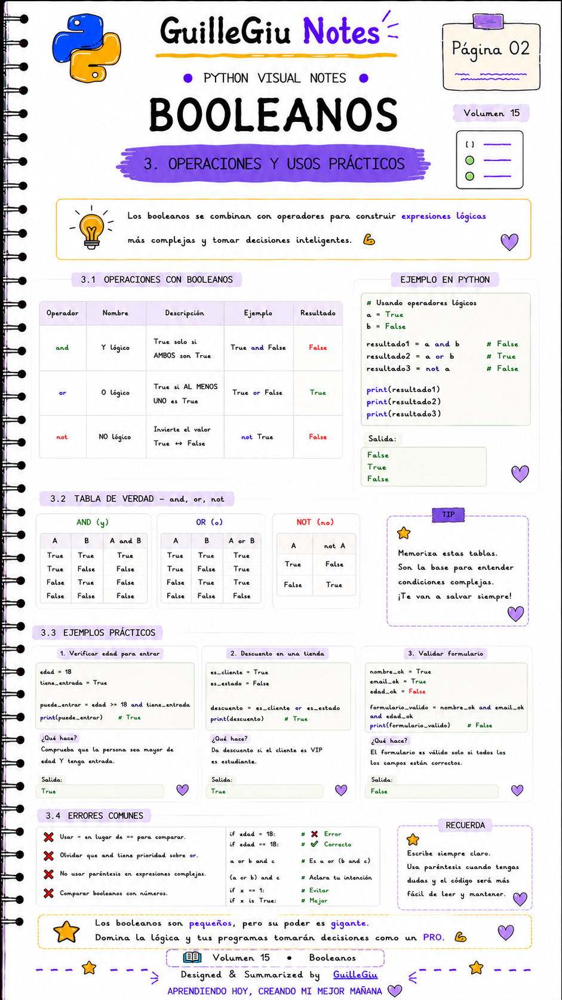
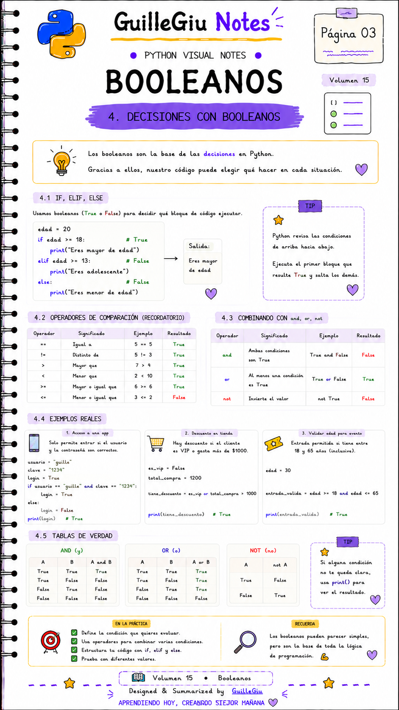
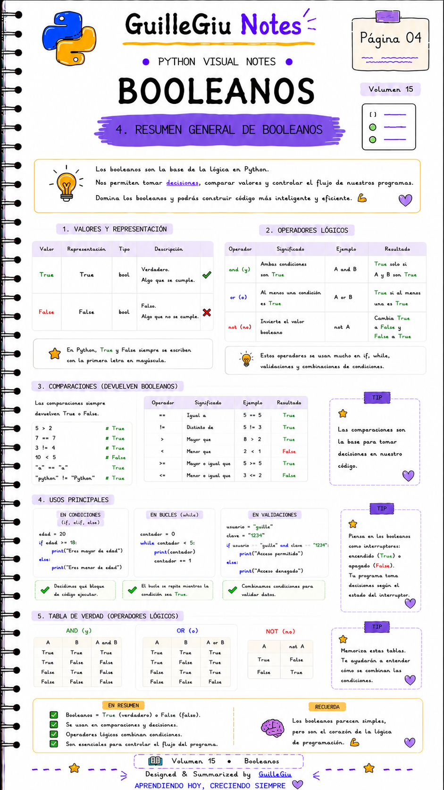

# 🐍 Volumen 15 · Booleanos

> Aprendé cómo funcionan los valores booleanos (`True` y `False`) y cómo se utilizan para tomar decisiones en Python.

---

  

  

  

  

---

  ⬅️ <a href="../volumen_14_string_methods/">Volumen 14 · String Methods</a>
  &nbsp; • &nbsp;
  <a href="../volumen_16_range_iteradores/">Volumen 16 · Range + Iteradores</a> ➡️

