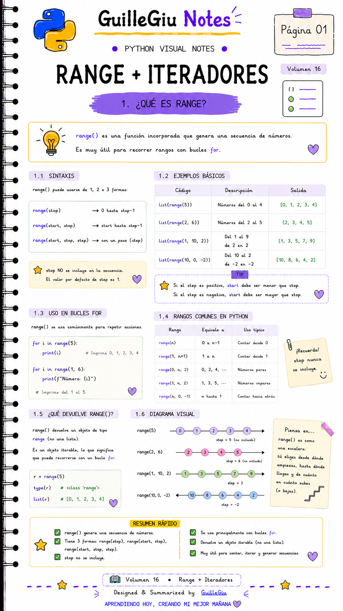
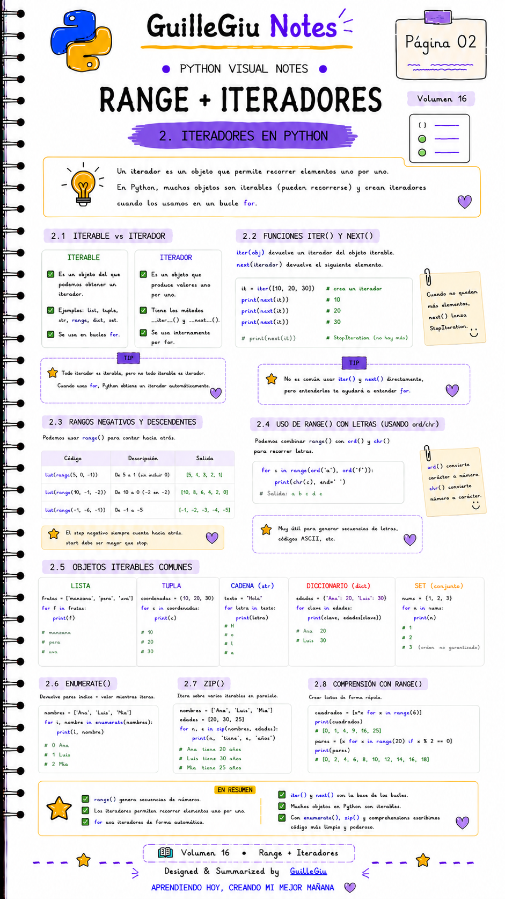
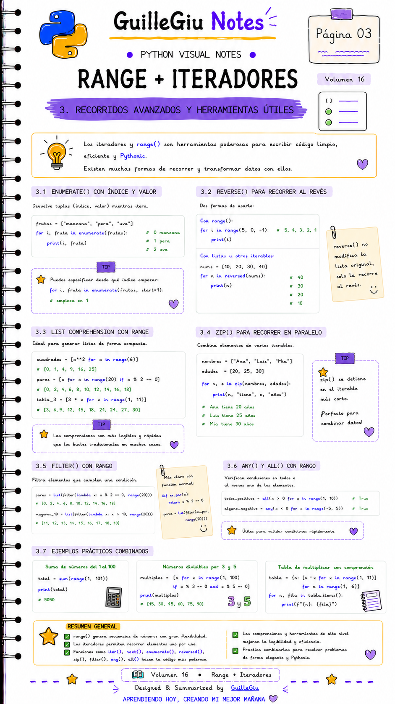
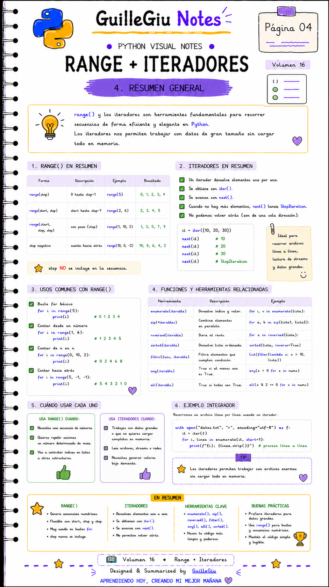

# 🐍 Volumen 16 · Range + Iteradores

> Aprendé a generar secuencias con `range()` y a recorrer colecciones utilizando iteradores de forma eficiente en Python.

---

  

  

  

  

---

  ⬅️ <a href="../volumen_15_booleanos/">Volumen 15 · Booleanos</a>
  &nbsp; • &nbsp;
  <a href="../volumen_17_modulos/">Volumen 17 · Módulos</a> ➡️

