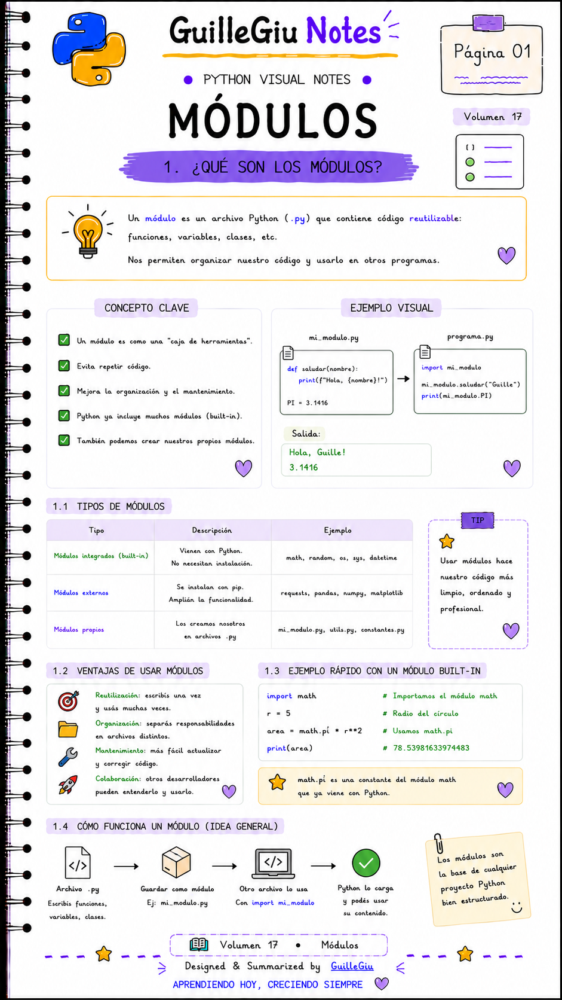
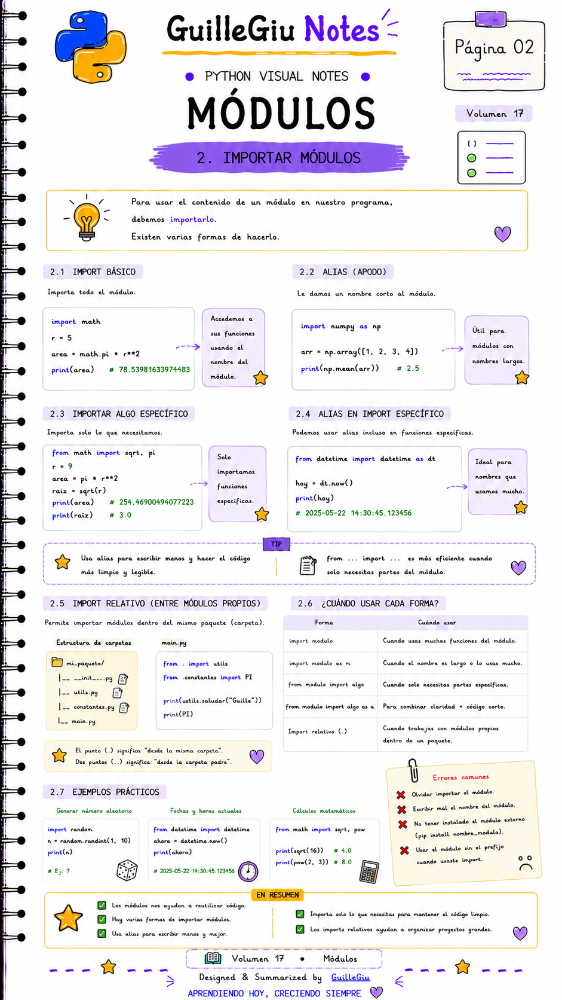
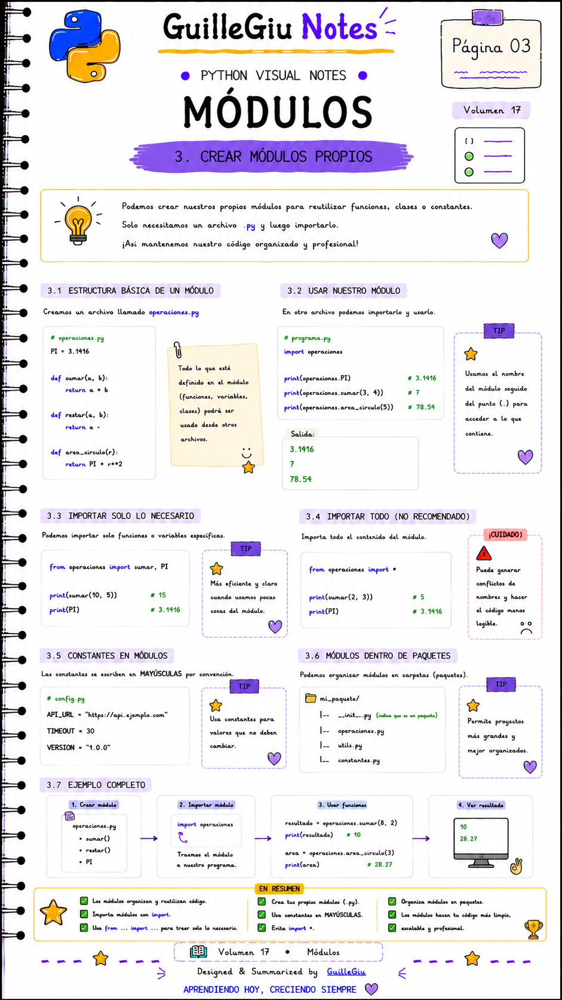
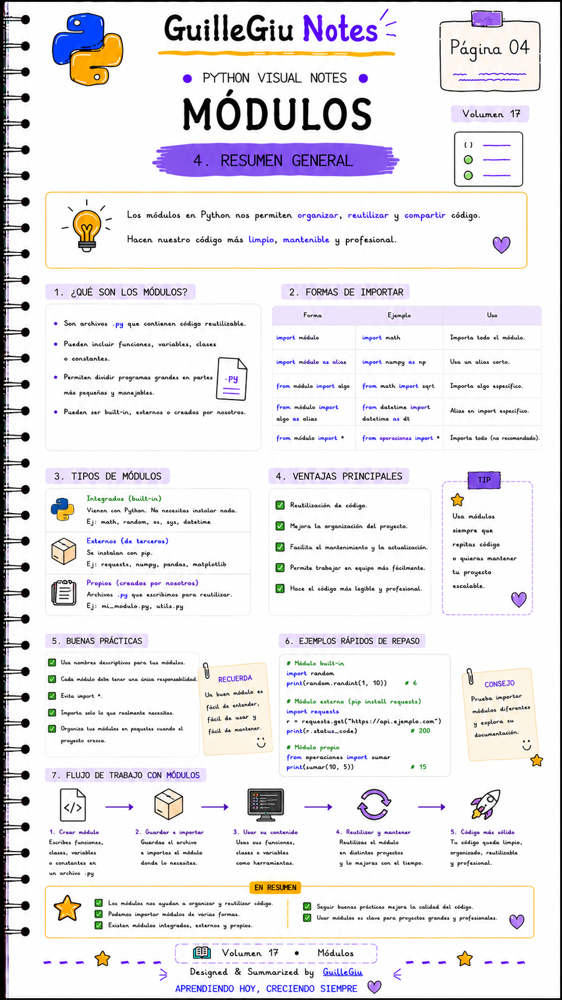

# 🐍 Volumen 17 · Módulos

> Aprendé a organizar tu código utilizando módulos y a reutilizar funciones, clases y variables mediante `import` en Python.

---

  

  

  

  

---

  ⬅️ <a href="../volumen_16_range_iteradores/">Volumen 16 · Range + Iteradores</a>
  &nbsp; • &nbsp;
  <a href="../volumen_18_datetime/">Volumen 18 · Datetime</a> ➡️

