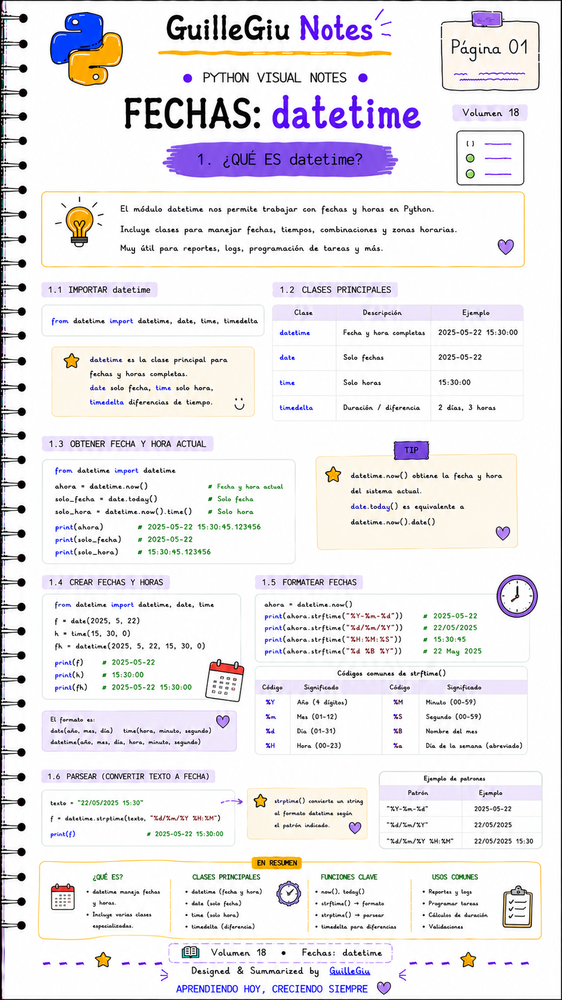
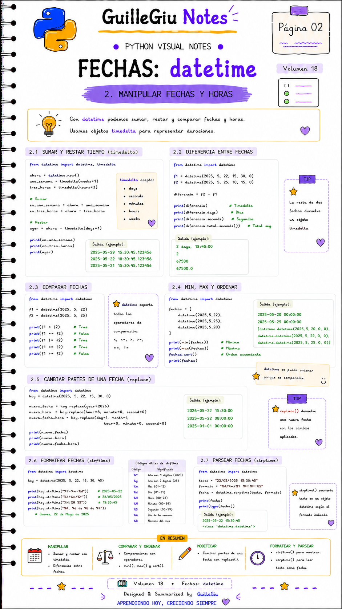
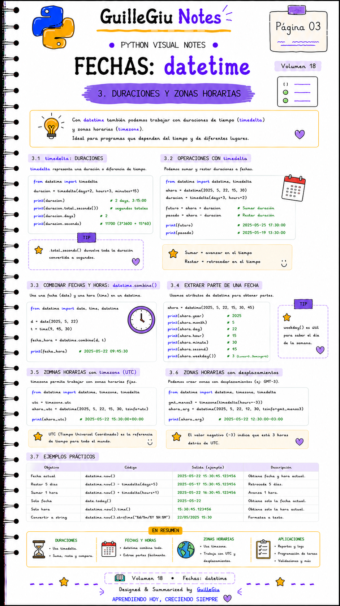
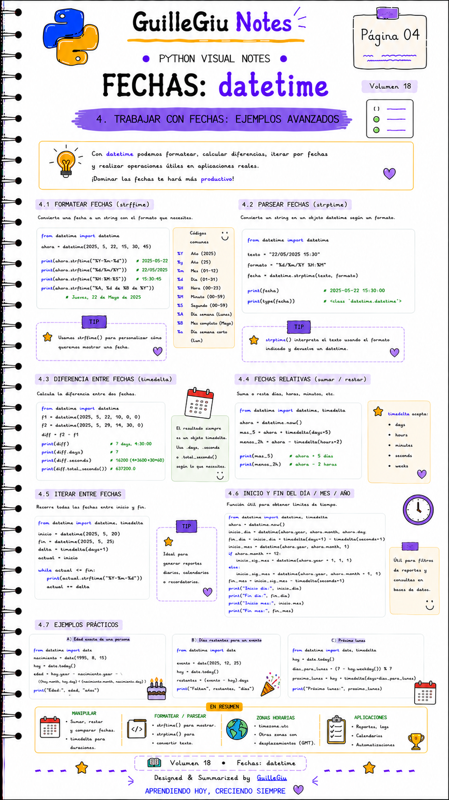

# 🐍 Volumen 18 · Datetime

> Aprendé a trabajar con fechas y horas utilizando el módulo `datetime`, una herramienta esencial para proyectos reales en Python.

---

  

  

  

  

---

  ⬅️ <a href="../volumen_17_modulos/">Volumen 17 · Módulos</a>
  &nbsp; • &nbsp;
  <a href="../volumen_19_math_random/">Volumen 19 · Math + Random</a> ➡️

