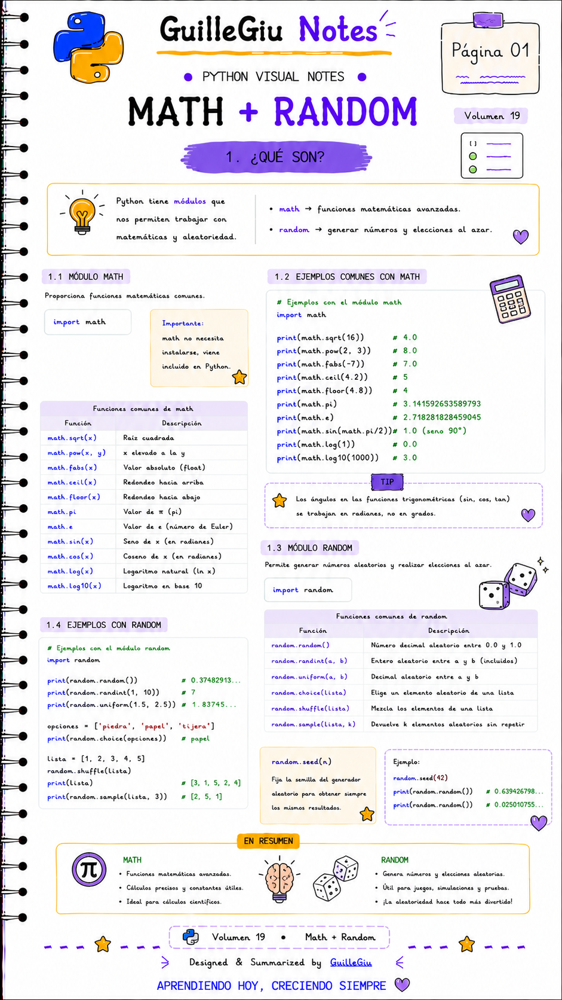
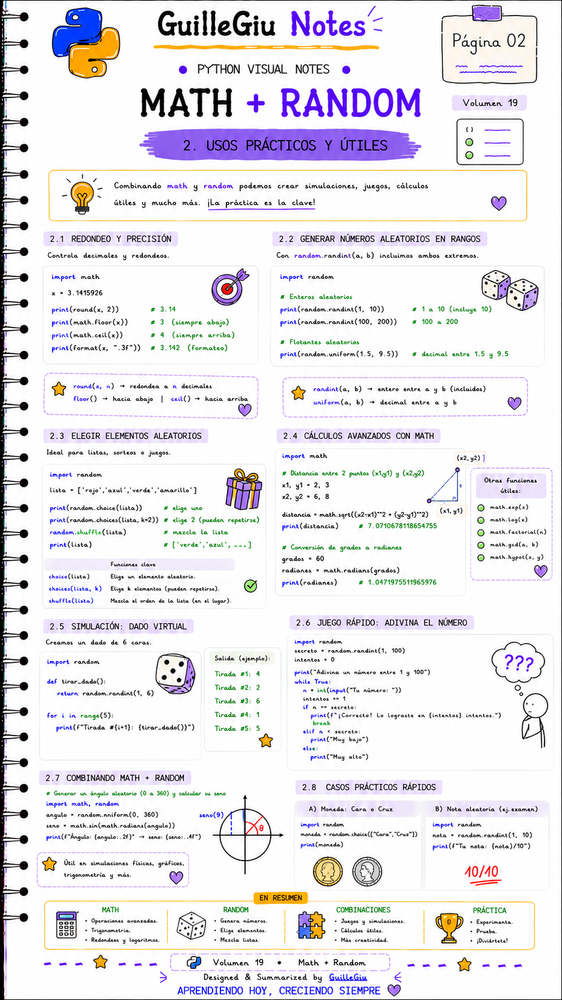
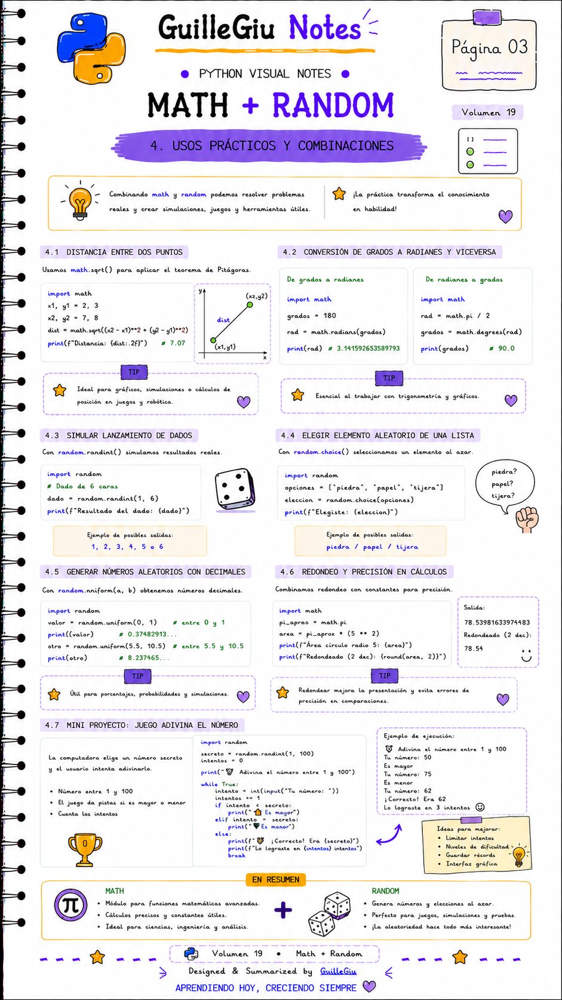

# 🐍 Volumen 19 · Math + Random

> Aprendé a utilizar los módulos `math` y `random` para realizar cálculos matemáticos y generar valores aleatorios en Python.

---

  

  

  

---

  ⬅️ <a href="../volumen_18_datetime/">Volumen 18 · Datetime</a>
  &nbsp; • &nbsp;
  <a href="../volumen_20_JSON/">Volumen 20 · JSON</a> ➡️

