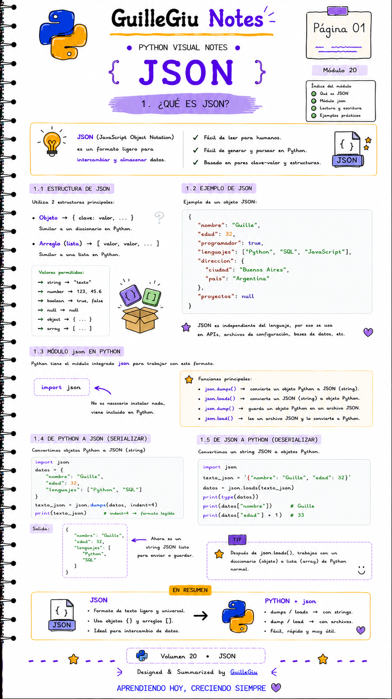
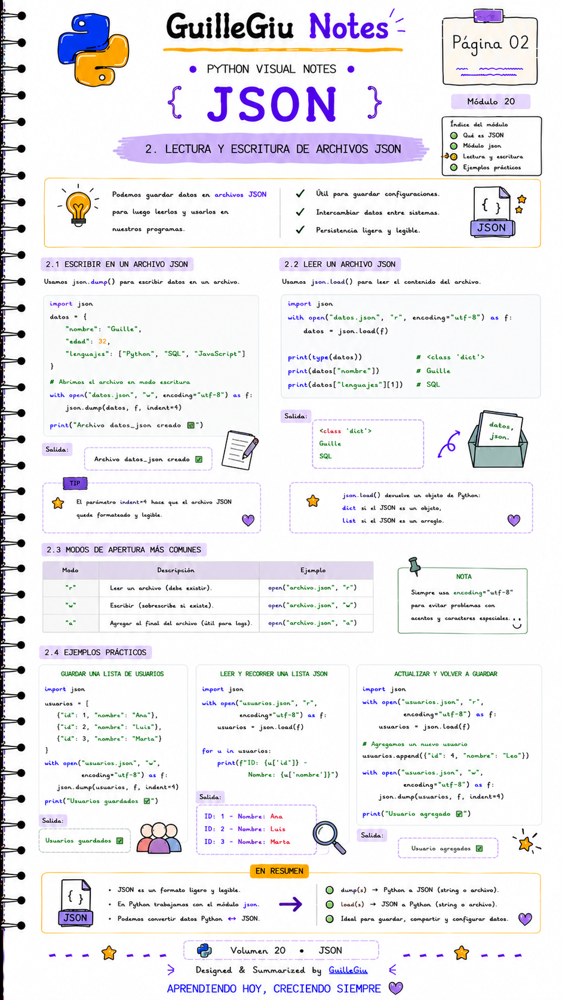

# 🐍 Volumen 20 · JSON

> Aprendé a trabajar con archivos y datos en formato JSON utilizando el módulo `json`, una herramienta fundamental para APIs y aplicaciones modernas.

---

  

  

---

  ⬅️ <a href="../volumen_19_math_random/">Volumen 19 · Math + Random</a>
  &nbsp; • &nbsp;
  <a href="../volumen_21_regex/">Volumen 21 · Expresiones Regulares (Regex)</a> ➡️

