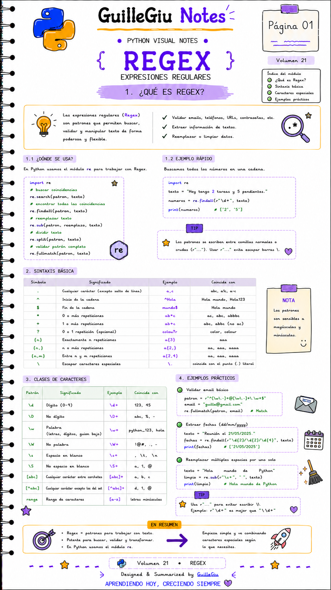
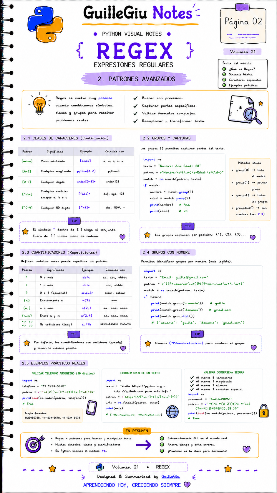

# 🐍 Volumen 21 · Expresiones Regulares (Regex)

> Aprendé a buscar, validar y extraer patrones dentro de textos utilizando expresiones regulares y el módulo `re` de Python.

---

  

  

---

  ⬅️ <a href="../volumen_20_JSON/">Volumen 20 · JSON</a>
  &nbsp; • &nbsp;
  <a href="../volumen_22_try_except/">Volumen 22 · Try/Except</a> ➡️

