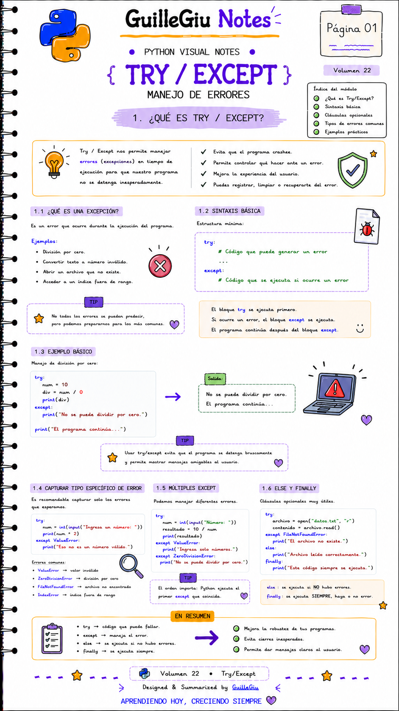

# 🐍 Volumen 22 · Try/Except

> Aprendé a controlar errores con `try` y `except` para evitar que un programa se detenga inesperadamente.

---

  

---

  ⬅️ <a href="../volumen_21_regex/">Volumen 21 · Expresiones Regulares (Regex)</a>
  &nbsp; • &nbsp;
  <a href="../volumen_23_files/">Volumen 23 · File Handling</a> ➡️

