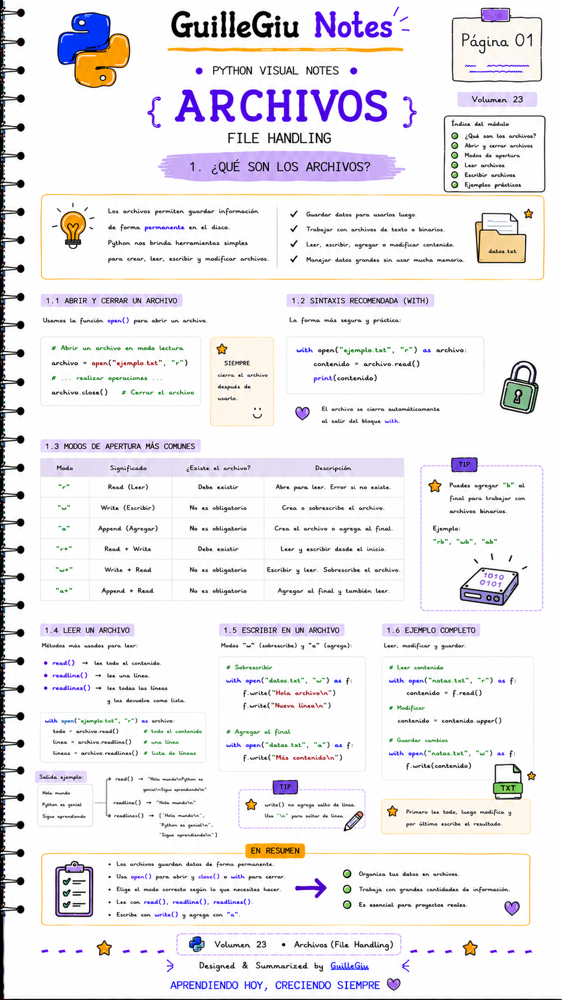
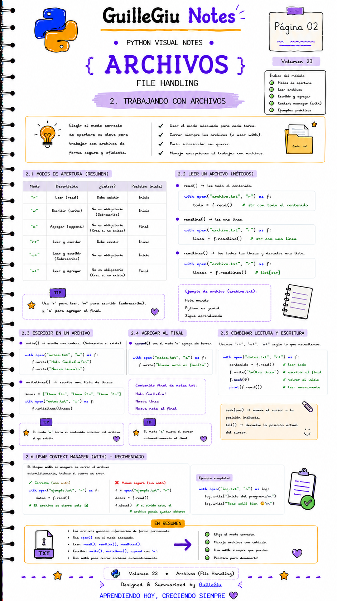

# 🐍 Volumen 23 · File Handling

> Aprendé a crear, leer, escribir y modificar archivos utilizando Python, una habilidad fundamental para trabajar con datos y automatizar tareas.

---

  

  

---

  ⬅️ <a href="../volumen_22_try_except/">Volumen 22 · Try/Except</a>
  &nbsp; • &nbsp;
  <a href="../volumen_24_poo/">Volumen 24 · Programación Orientada a Objetos</a> ➡️

