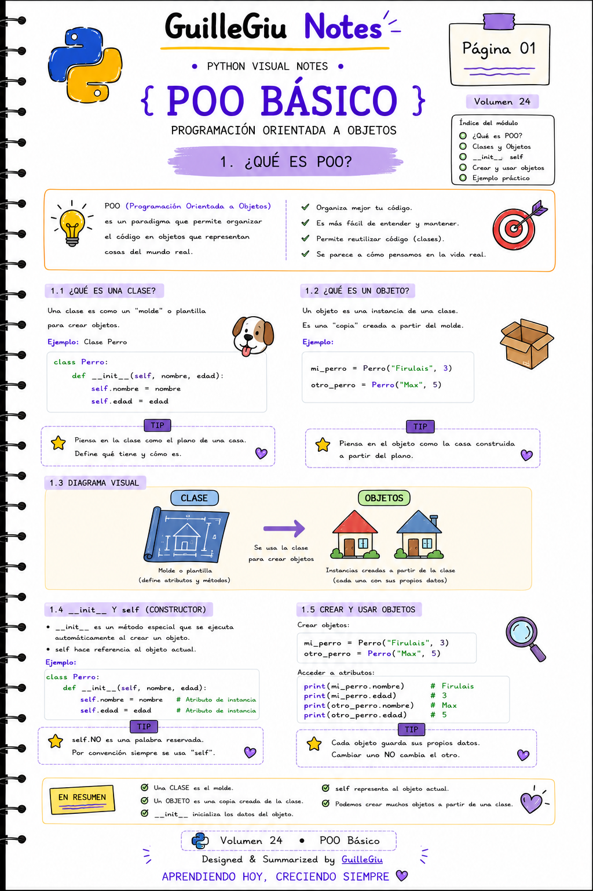
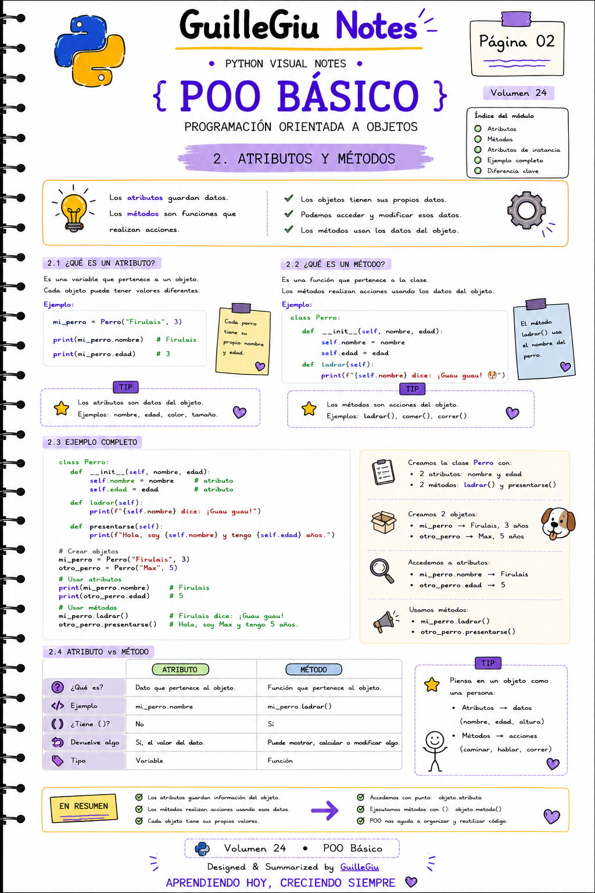
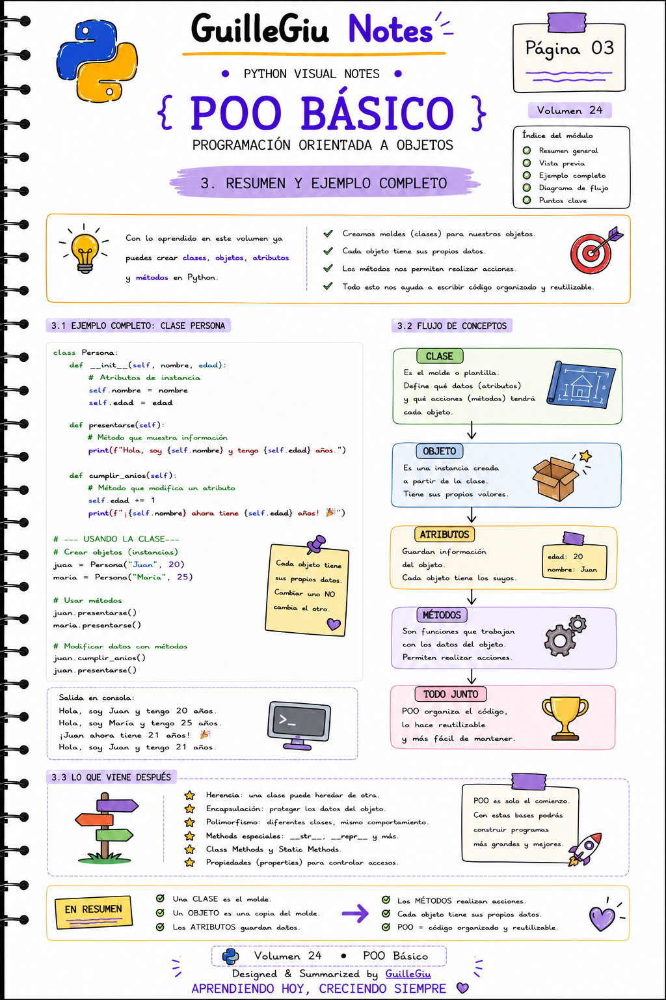

# 🐍 Volumen 24 · Programación Orientada a Objetos

> Aprendé los fundamentos de la Programación Orientada a Objetos en Python: clases, objetos, atributos y métodos.

---

  

  

  

---

  ⬅️ <a href="../volumen_23_files/">Volumen 23 · File Handling</a>
  &nbsp; • &nbsp;
  <a href="../">Volver a Python</a> 🐍

