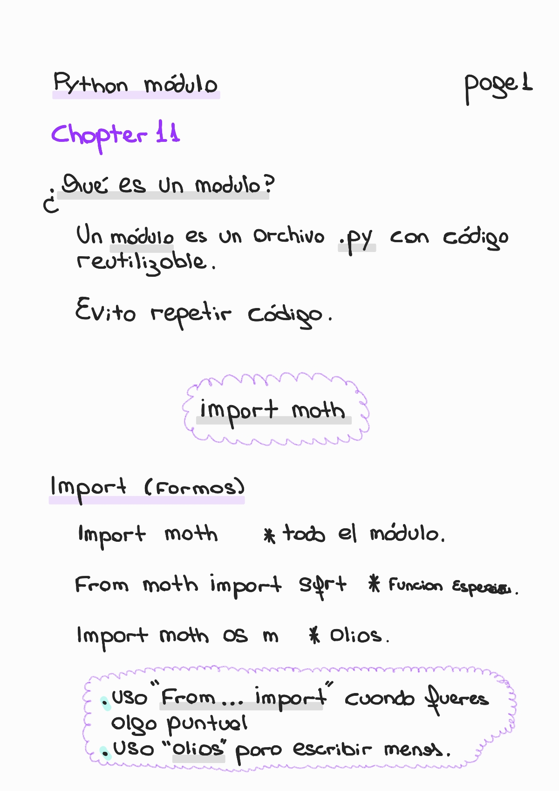
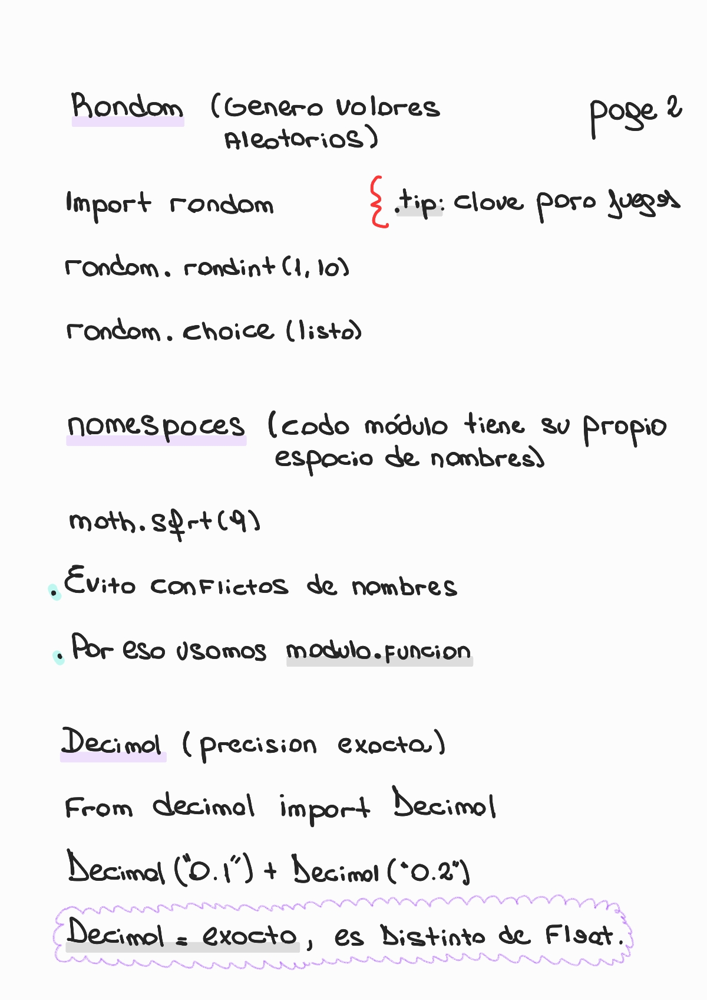
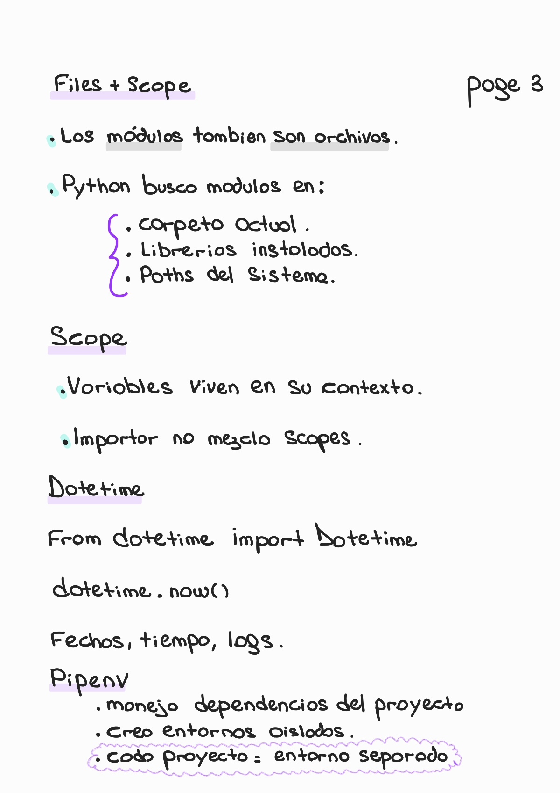
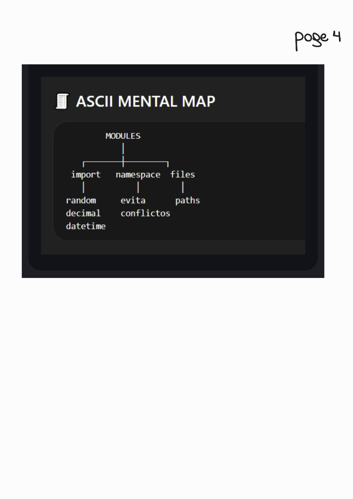

# 📦 Chapter 11 — Modules

🏠 [Volver al repositorio principal](../../README.md)

⬅️ [Capítulo anterior — String Methods](../chapter10_string_methods/README.md)

💻 [Ver ejemplos prácticos](../../code_examples/chapter11/README.md)

---

## 📌 Contenido del capítulo

- ¿Qué es un módulo?
- Importación (`import`, `from`)
- Namespaces
- Módulo `random`
- Módulo `decimal`
- Files y scope
- Datetime
- Pipenv
- ASCII Mental Map

---

## 📖 ¿Qué es un módulo? (Page 1)

  

---

## 🔧 Import + Namespaces (Page 2)

  

---

## 📚 Módulos útiles (Page 3)

  

---

## 🧠 ASCII Mental Map (Page 4)

  

---
