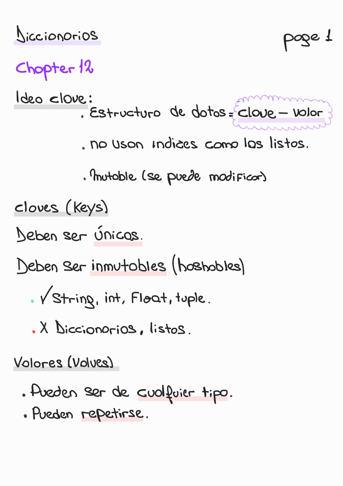
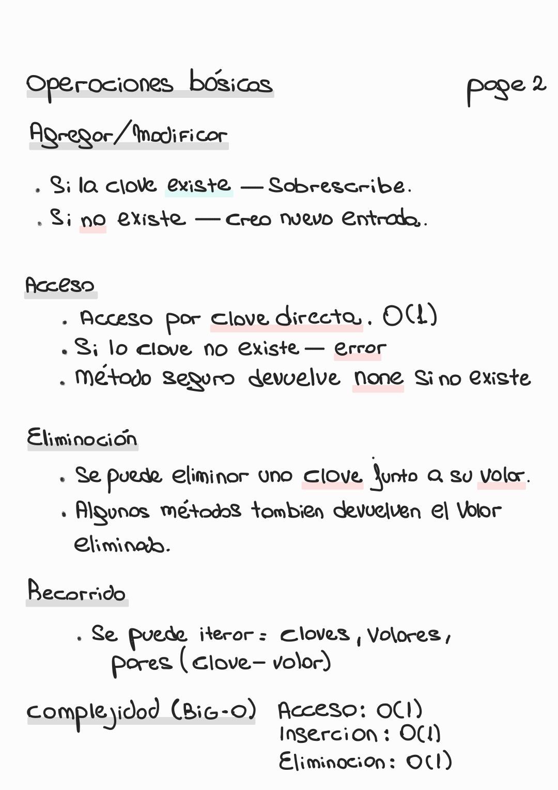
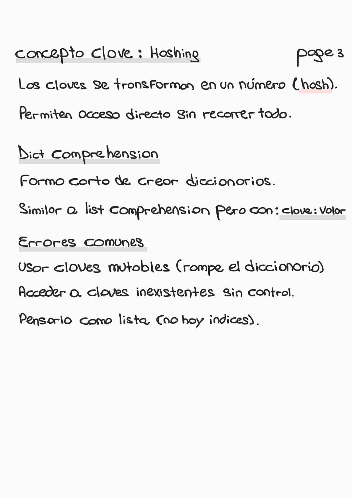
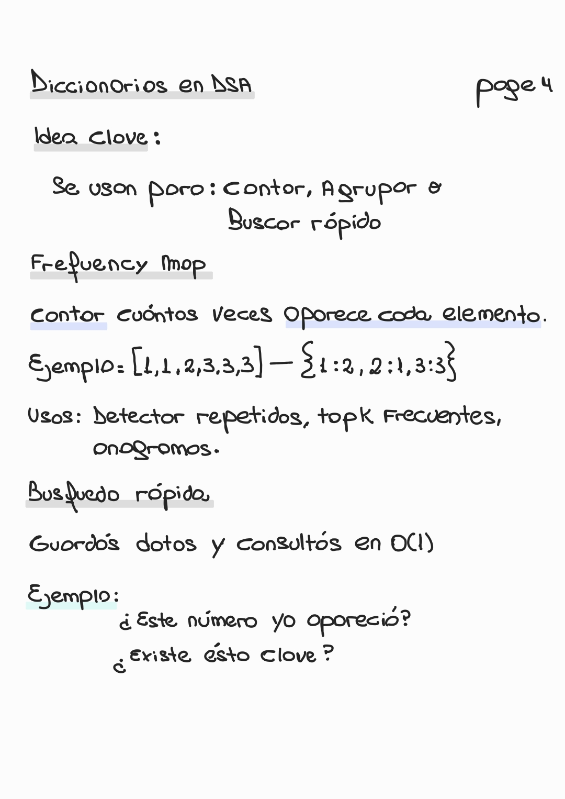
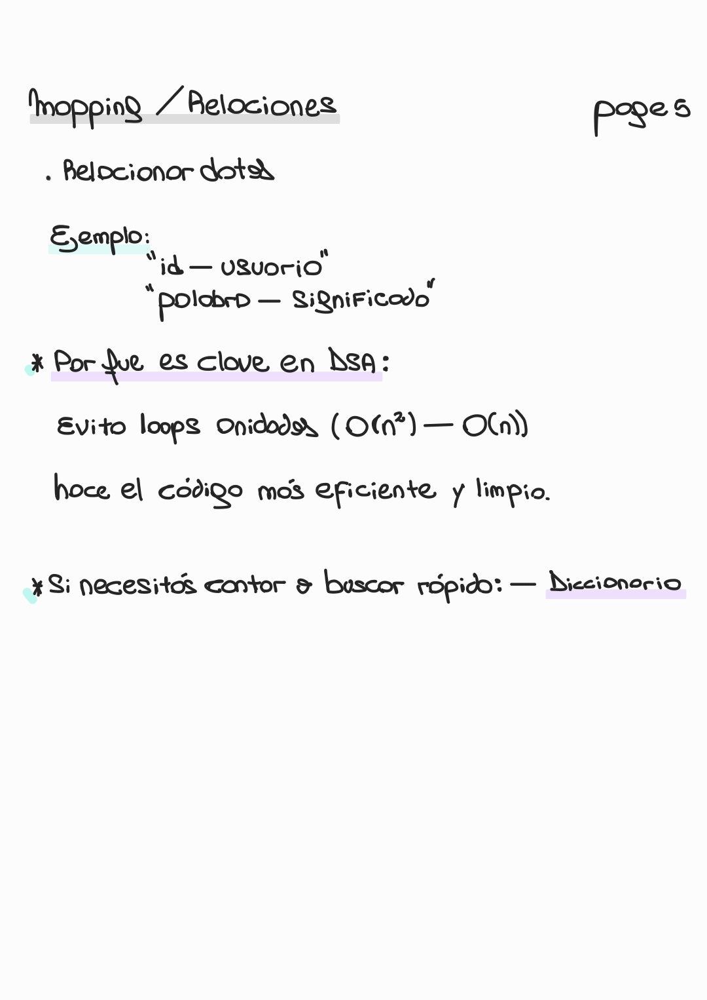

# 📘 Chapter 12 — Dictionaries

🏠 [Volver al repositorio principal](../../README.md)

⬅️ [Capítulo anterior — Modules](../chapter11_modules/README.md)

➡️ [Capítulo siguiente — (próximo)](#)

---

## 📌 Contenido del capítulo

- Idea clave (clave → valor)
- Claves y valores
- Operaciones básicas
- Acceso y eliminación
- Complejidad (Big-O)
- Hashing
- Dict comprehension
- Errores comunes
- Uso en DSA (frequency map, búsqueda)
- Mapping / relaciones

---

## 🧠 📄 Introducción (Page 1)

  

---

## ⚙️ 📄 Operaciones básicas (Page 2)

  

---

## 🧩 📄 Hashing + errores (Page 3)

  

---

## 🚀 📄 DSA (Page 4)

  

---

## 🔗 📄 Mapping / relaciones (Page 5)

  

