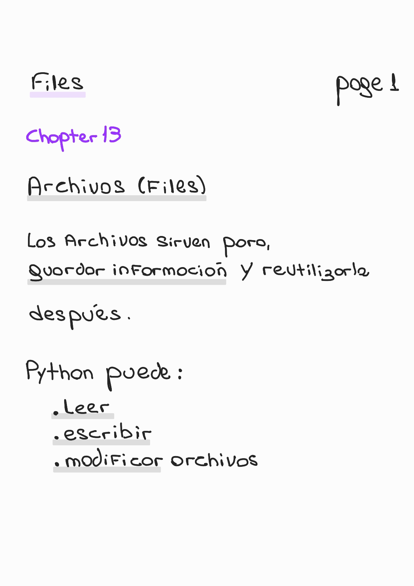
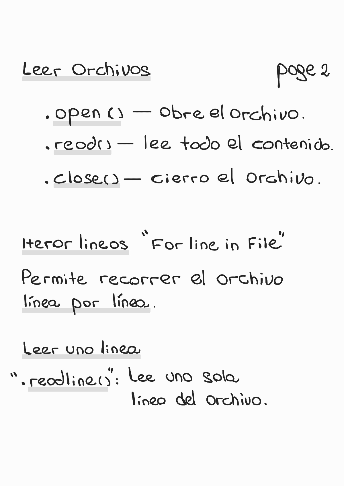
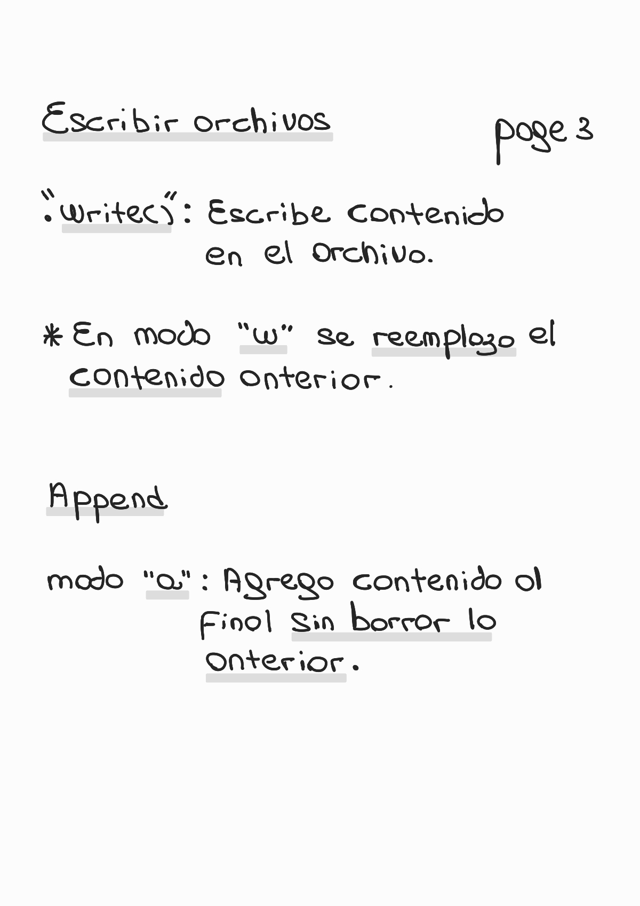
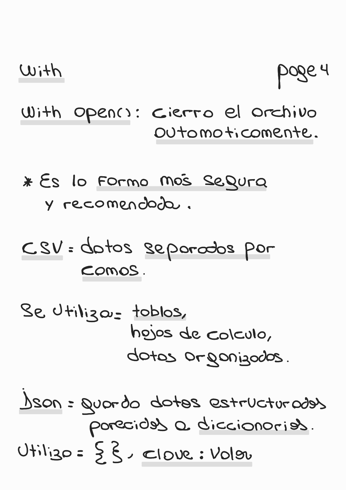

# 📘 Chapter 13 — Files

🏠 [Volver al repositorio principal](../../README.md)

⬅️ [Capítulo anterior — Dictionaries](../chapter12_dictionaries/README.md)

💻 [Ver ejemplos prácticos](../../code_examples/chapter13_files/README.md)

---

## 📌 Contenido del capítulo

- Qué son los archivos
- Leer archivos
- write()
- Modos de apertura
- Append
- with open()
- CSV
- JSON
- Iterar líneas
- readline()

---

## 🚀 Conceptos importantes

- `open()` abre archivos.
- `read()` lee contenido.
- `write()` escribe contenido.
- `"w"` reemplaza contenido.
- `"a"` agrega contenido al final.
- `with open()` es la forma recomendada.
- CSV guarda datos tabulares.
- JSON guarda datos estructurados.

---

## 📚 Recursos útiles

- Archivos en Python
- CSV y JSON
- Manejo seguro con `with`
---

## 🧠 📄 Introducción (Page 1)

  

---

## 📖 📄 Leer archivos (Page 2)

  

---

## ✍️ 📄 Escribir archivos (Page 3)

  

---

## 🔒 📄 With + formatos (Page 4)

  

---

