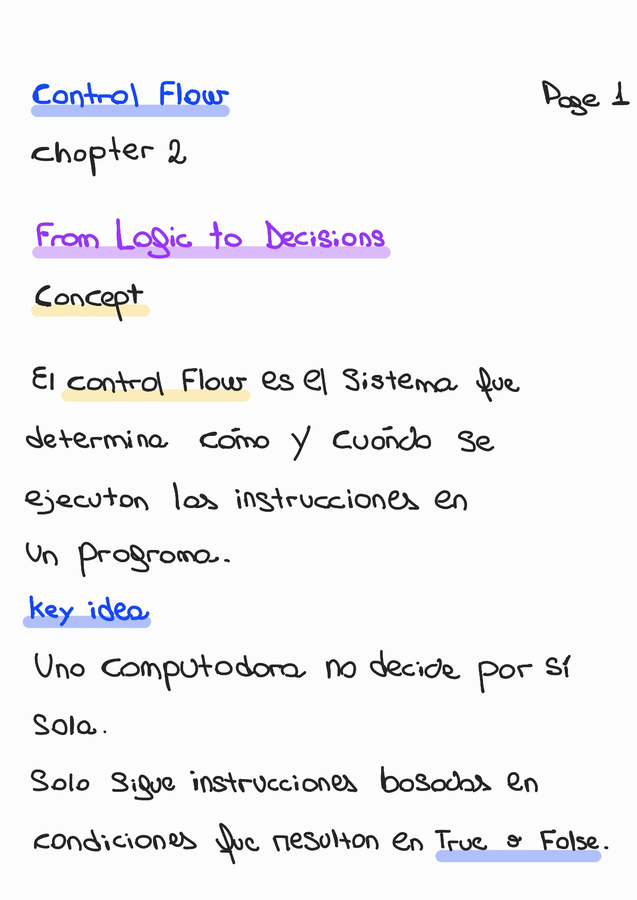
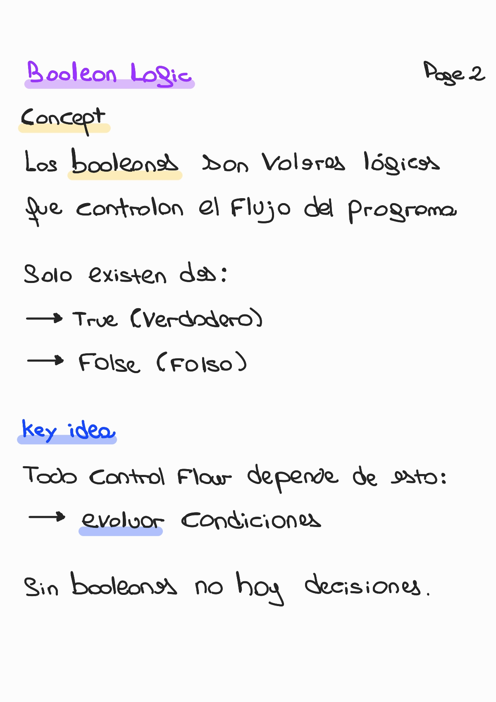
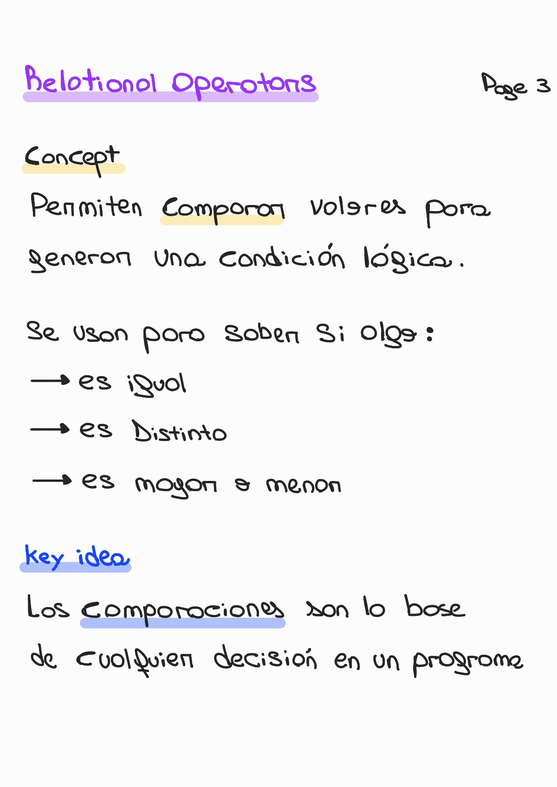
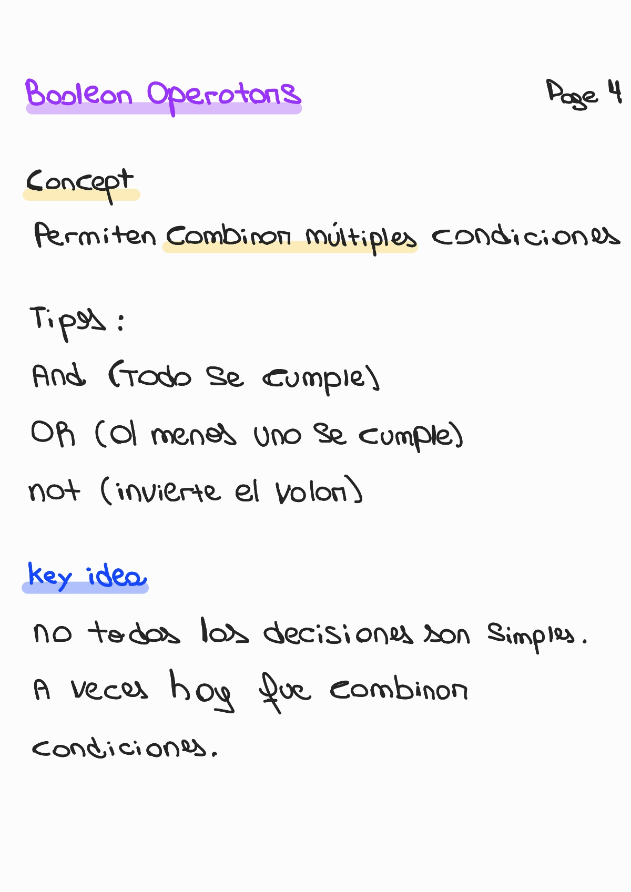
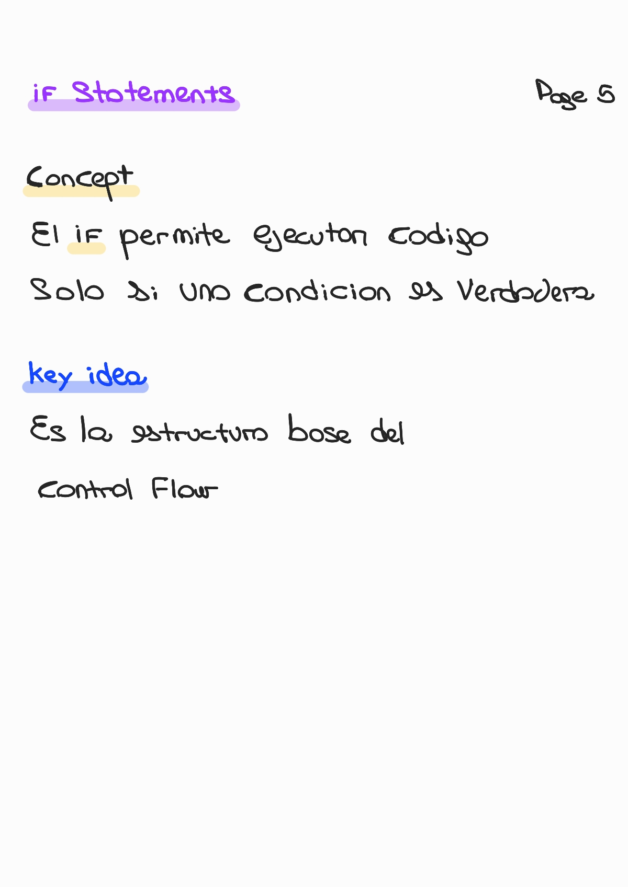
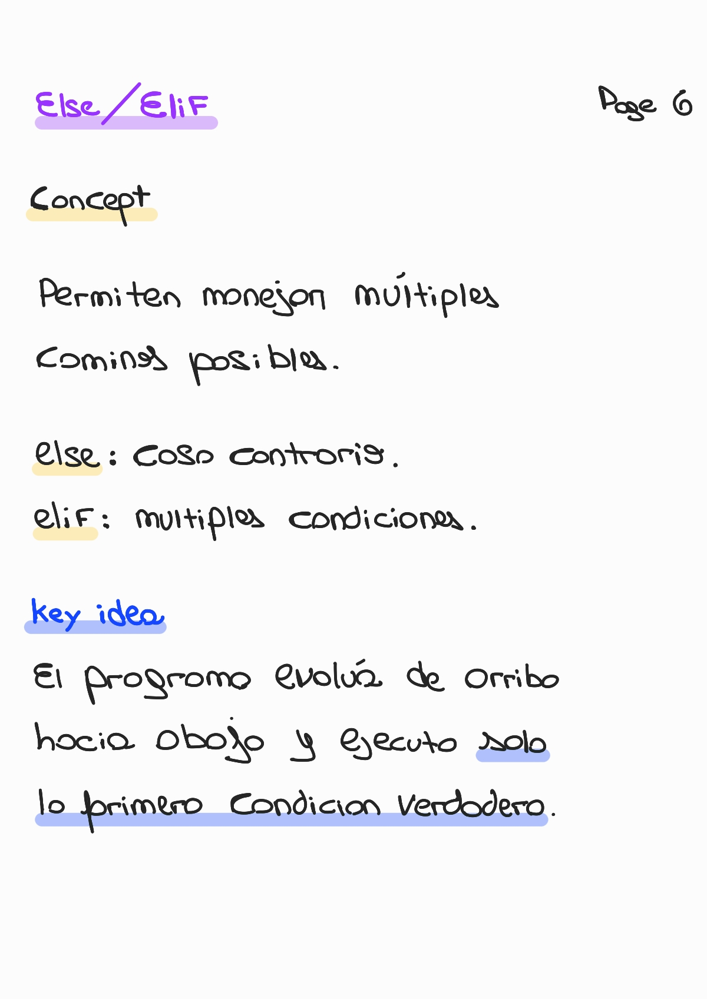
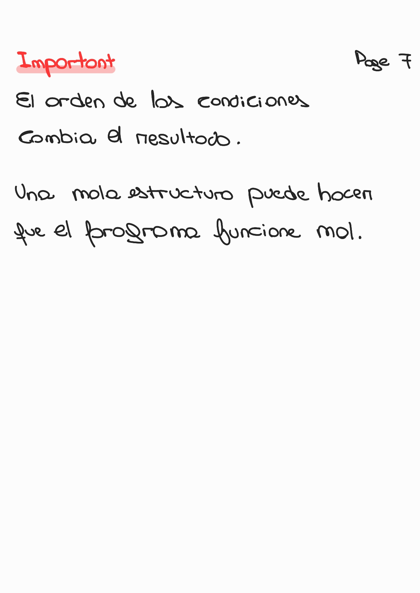
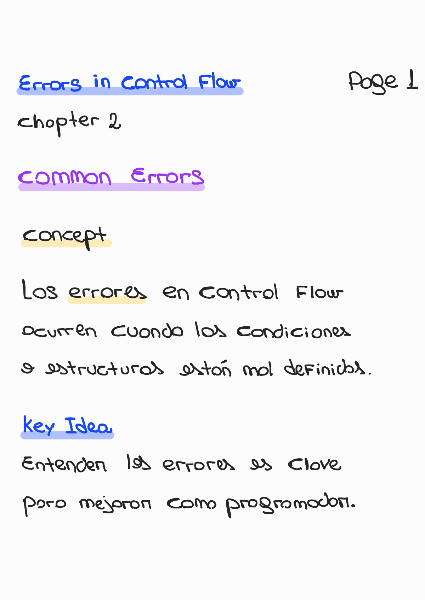
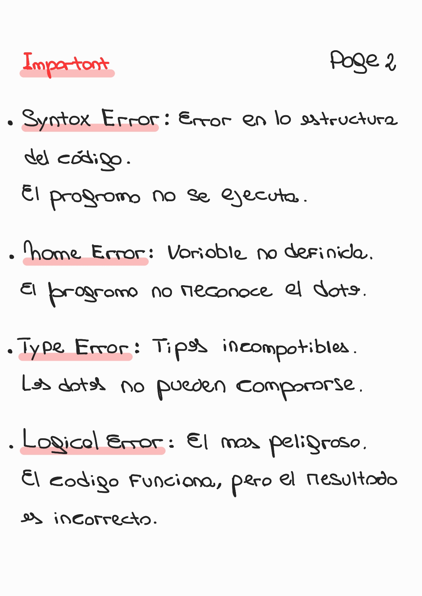
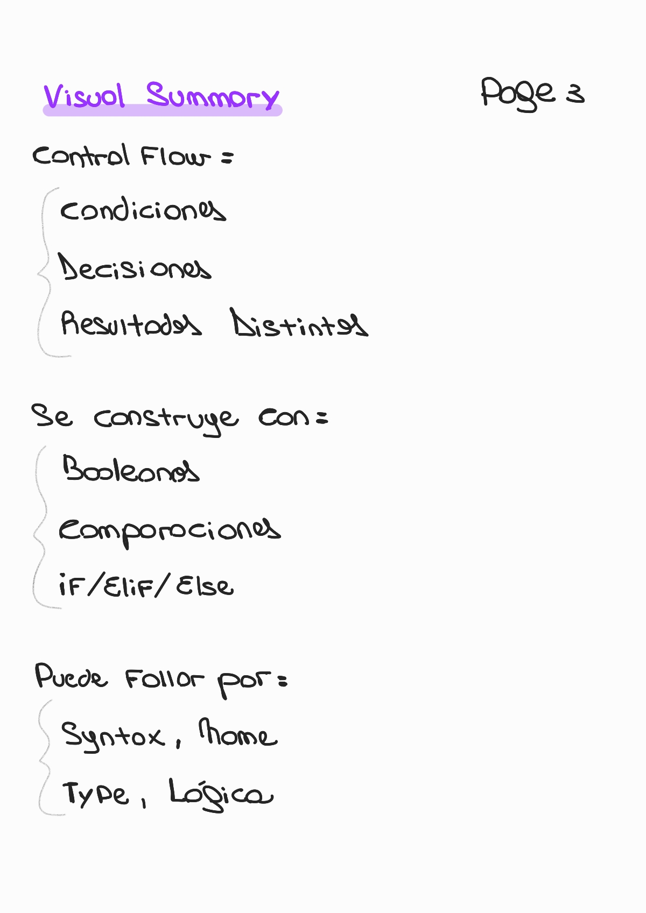

# Chapter 2 — Control Flow

🏠 [Volver al repositorio principal](../../README.md)

⬅️ [Capítulo anterior — Introducción a la Programación](../chapter1_introduction/README.md)

➡️ [Capítulo siguiente — Variables and Data Types](../chapter3_variables/README.md)

📌 Este capítulo introduce el control del flujo en un programa.
Explica cómo tomar decisiones usando condiciones (True / False).

---

## 🛠️ Contenido del capítulo

- Qué es el control flow
- Toma de decisiones en programas
- Condiciones (True / False)
- Cómo se ejecutan las instrucciones

---

## From Logic to Decisions

  

  

---

## Boolean Logic

  

---

## Relational Operators

  

---

## Boolean Operators

  

---

## If Statements

  

---

## Else / Elif

  

---

## Important

  

---

## ⚠️ Common Errors in Control Flow

Comprender los errores comunes es fundamental para escribir programas correctos y fiables.

  

---

## 🧠 Error Types Explained

  

---

## 🧩 Visual Summary

  

---
