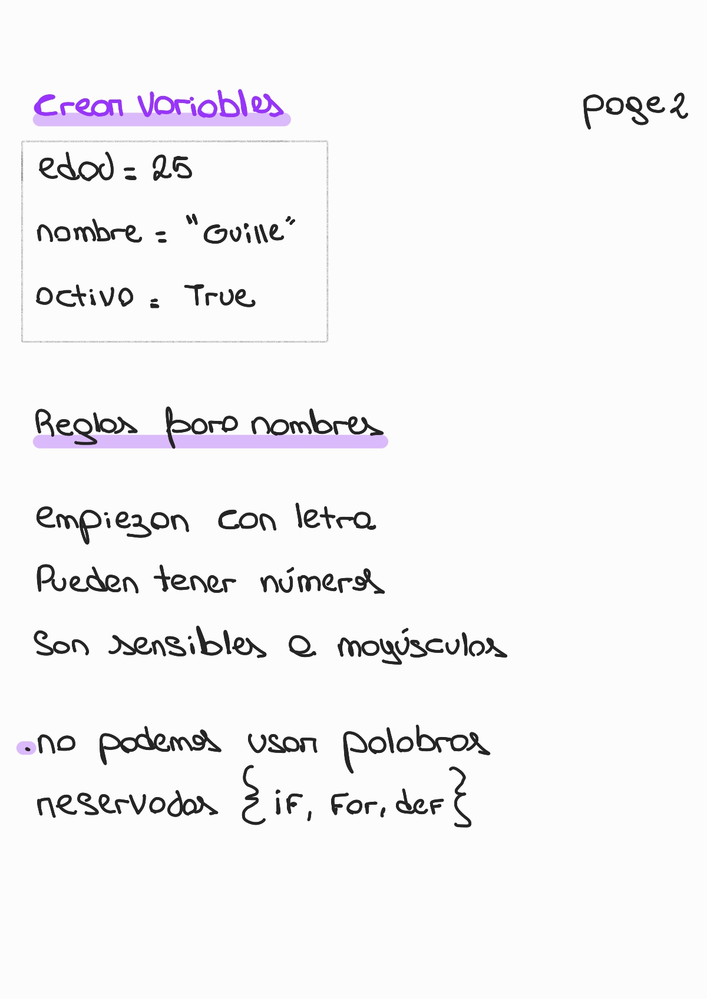
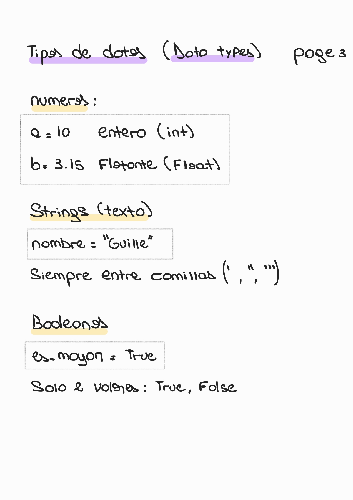
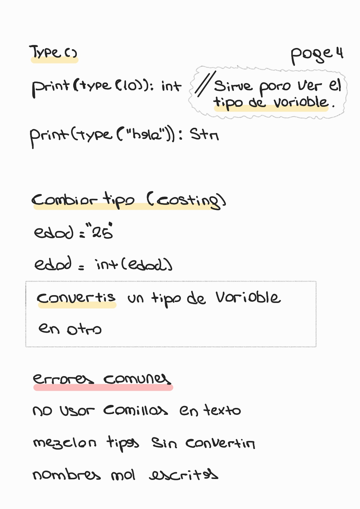

# Chapter 3 — Variables and Data Types

🏠 [Volver al repositorio principal](../../README.md)

---

⬅️ [Capítulo anterior — Control Flow](../chapter2_control_flow/README.md)

---

Este capítulo explica cómo guardar información en variables y los tipos de datos básicos en Python.

---

## Variables and Data Types

  

  

  

  

