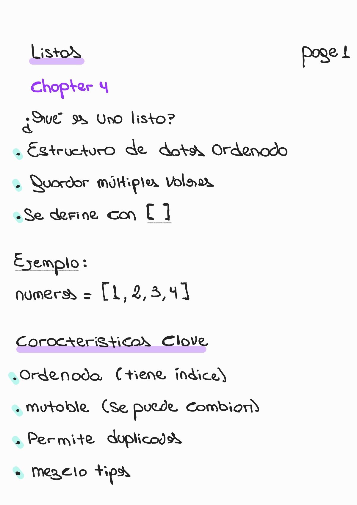
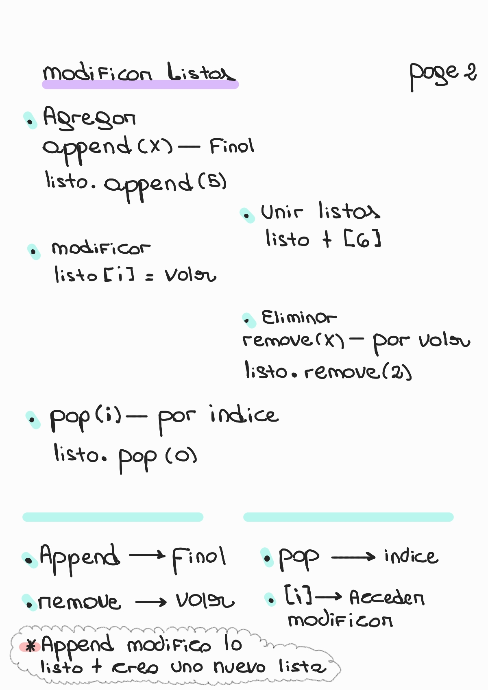
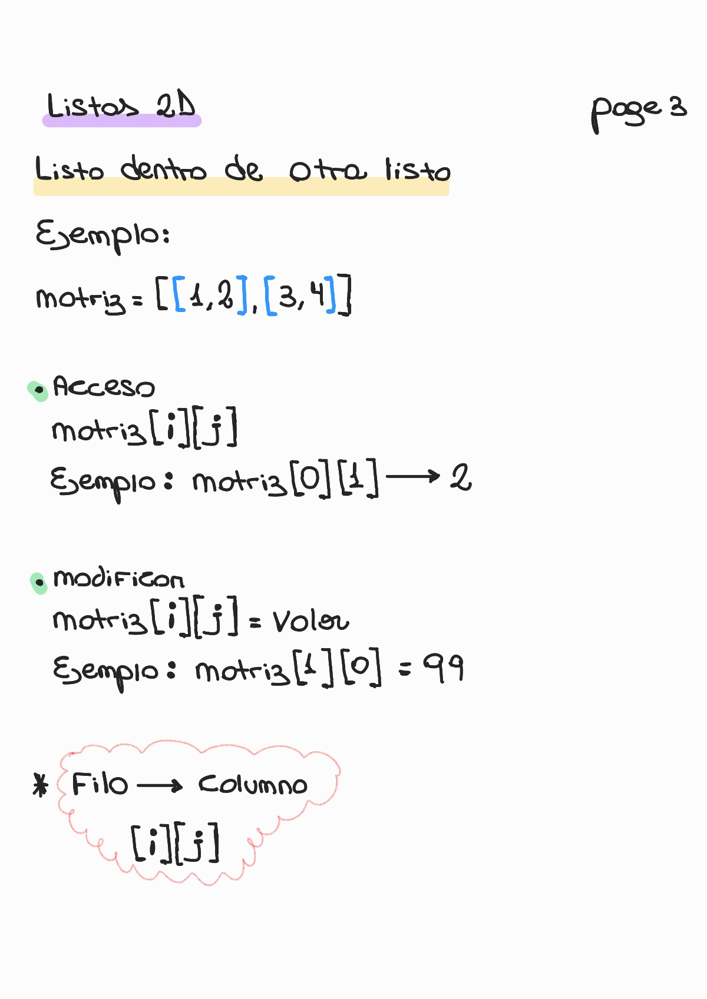
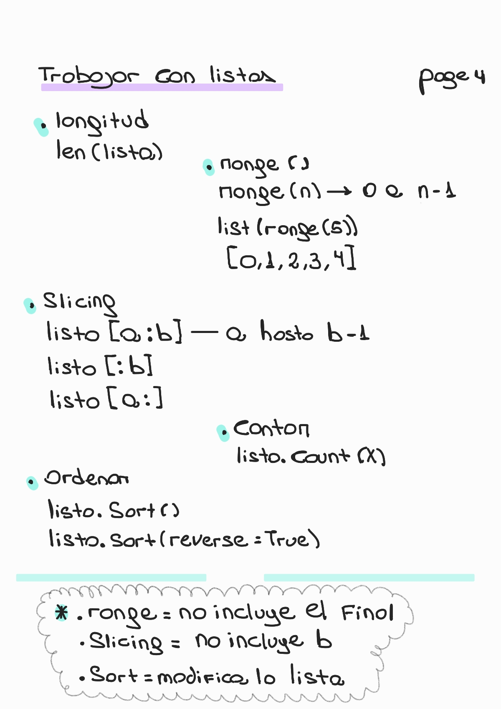

# Chapter 4 — Lists

🏠 [Volver al repositorio principal](../../README.md)

⬅️ [Capítulo anterior — Variables and Data Types](../chapter3_variables/README.md)

➡️ [Capítulo siguiente — Loops](../chapter5_loops/README.md)

---

## 🛠️ Contenido del capítulo

- ¿Qué es una lista?
- Características clave
- Acceso por índice
- Modificación de listas
- Listas 2D
- Slicing, range y sort

---

## 📘 Lists

### 🧠 Concept & Key Idea

  

---

### ➕ Modificar Listas

  

---

### 🧩 Listas 2D

  

---

### ⚙️ Operaciones

  

