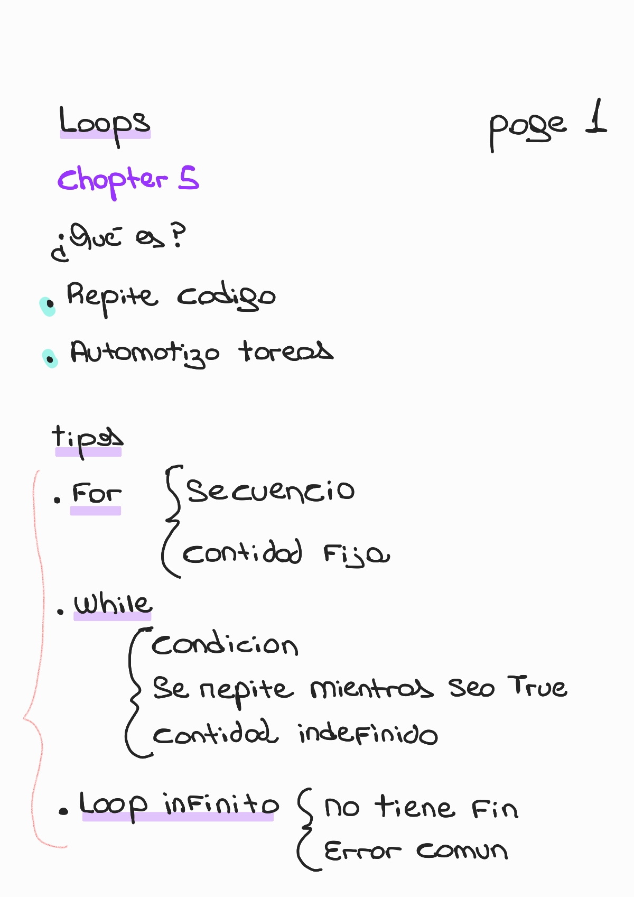
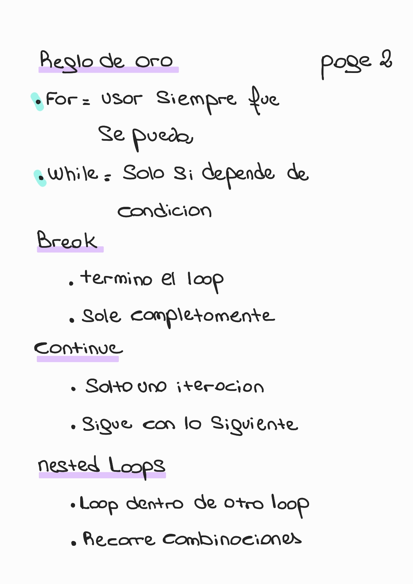
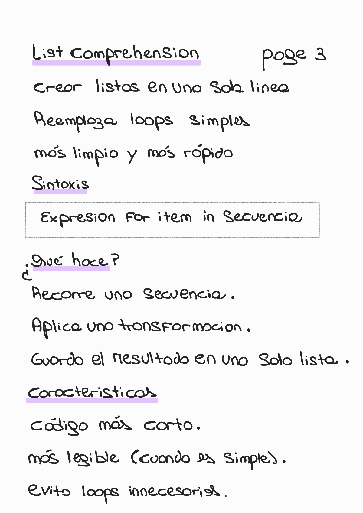
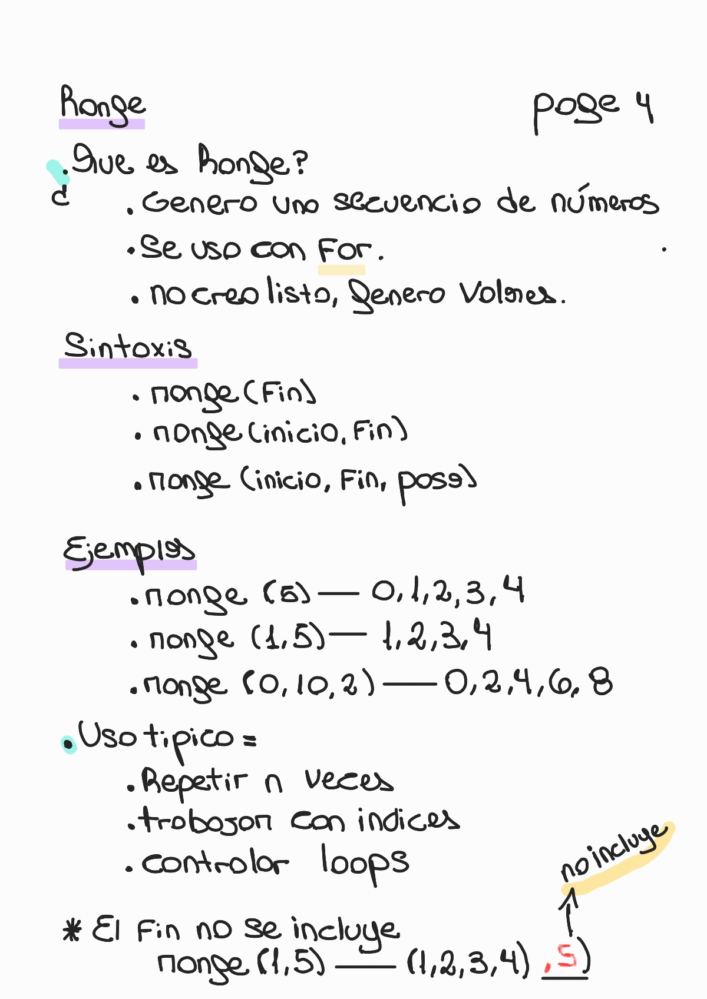

# 🔁 Chapter 5 — Loops

🏠 [Volver al repositorio principal](../../README.md)

⬅️ [Capítulo anterior — Lists](../chapter4_lists/README.md)

---

## 🛠️ Contenido del capítulo

- ¿Qué son los loops?
- ¿Por qué usar loops?
- For loops
- While loops
- Loops infinitos
- Break
- Continue
- Nested loops (loops anidados)
- List comprehensions
- Range

---

## 🔁 Loops

### 🧠 Conceptos básicos

  

---

### 🧠 Control de loops

  

---

### 🧠 List Comprehensions

  

---

### 🔢 Range

  

