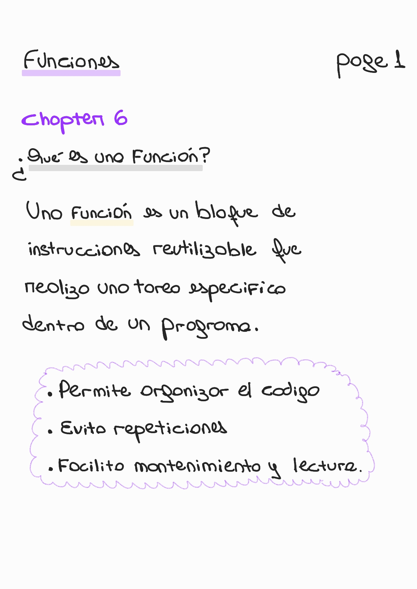
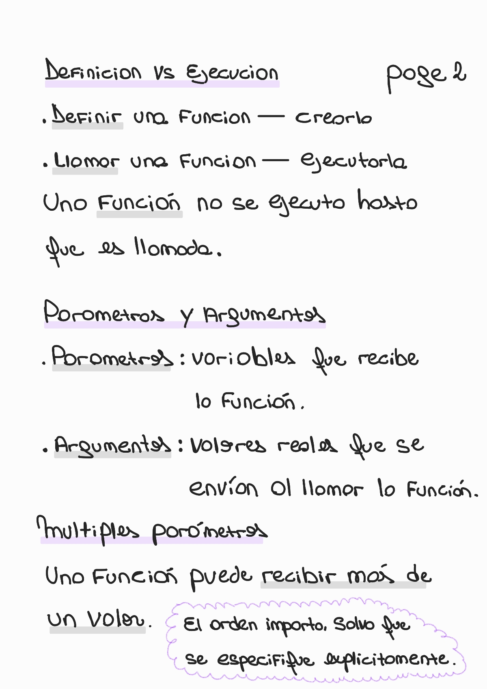
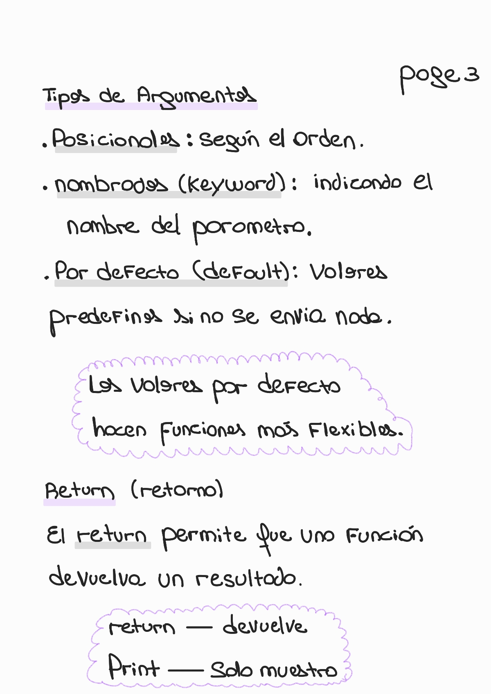
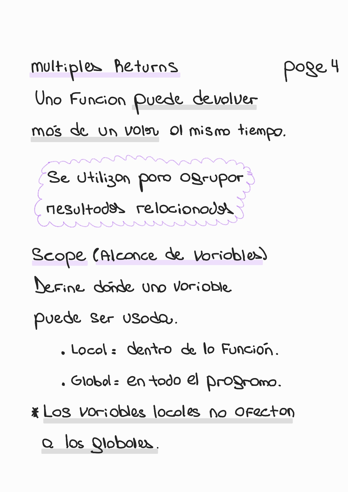
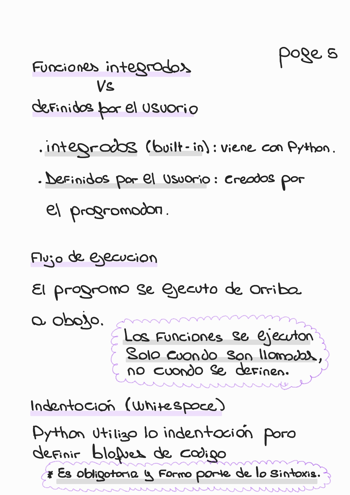
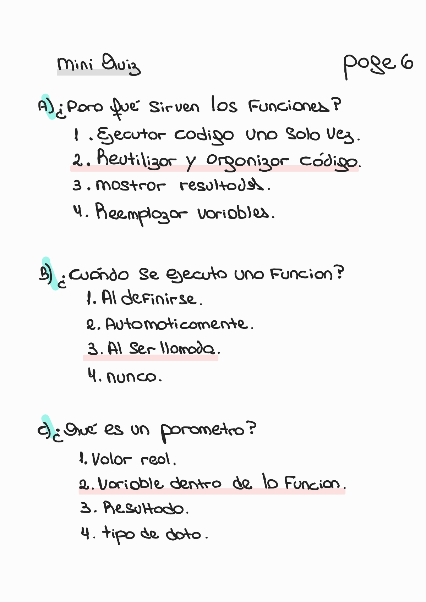
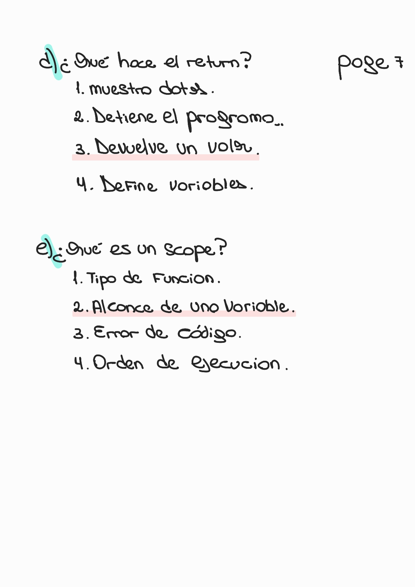

# 📘 Chapter 6 — Functions

🏠 [Volver al repositorio principal](../../README.md)

⬅️ [Capítulo anterior — Loops](../chapter5_loops/README.md)

➡️ [Capítulo siguiente — CLI](../chapter7_cli/README.md)

---

## 🛠️ Contenido del capítulo

- ¿Qué es una función?
- ¿Por qué usar funciones?
- Definir una función
- Llamar funciones
- Parámetros y argumentos
- Tipos de argumentos
- Return
- Scope (alcance de variables)
- Flujo de ejecución

---

## 🔹 Functions

### 🧠 ¿Qué es una función?

  

---

### 🧠 Definición, parámetros y ejecución

  

---

### 🧠 Tipos de argumentos y return

  

---

### 🧠 Multiple returns y scope

  

---

### 🧠 Funciones y ejecución

  

---

### 🧠 Mini quiz (parte 1)

  

---

### 🧠 Mini quiz (parte 2)

  

