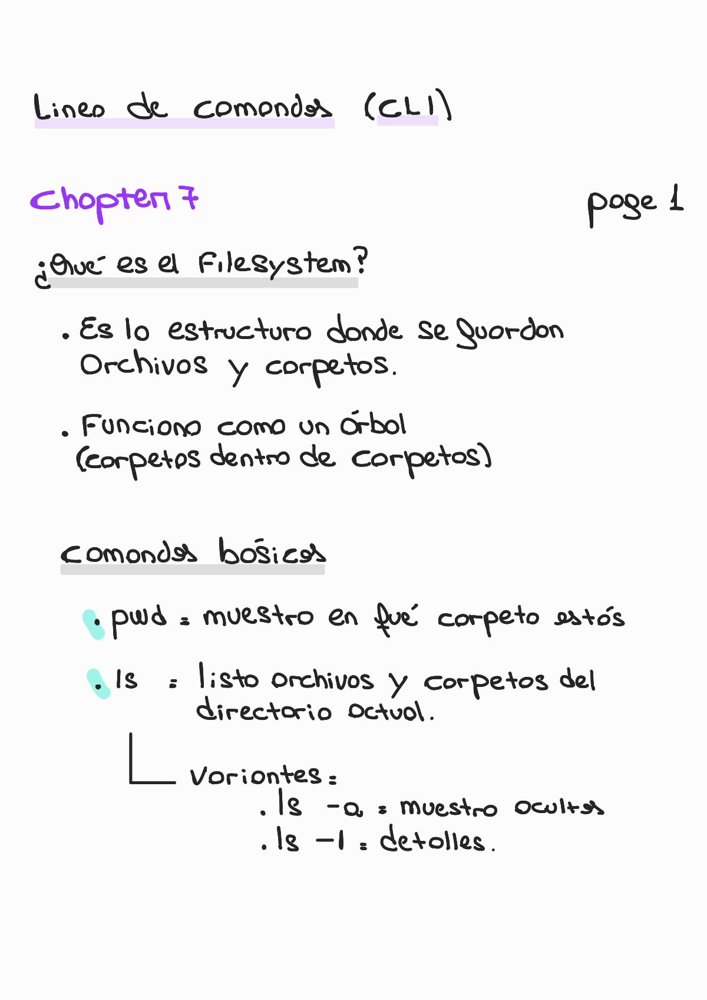
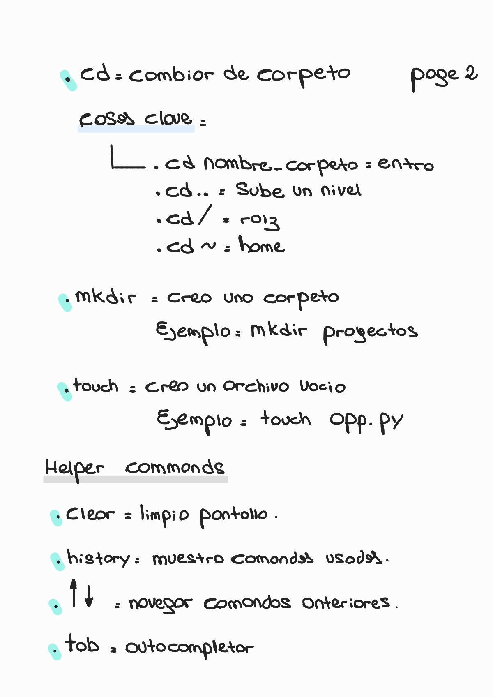
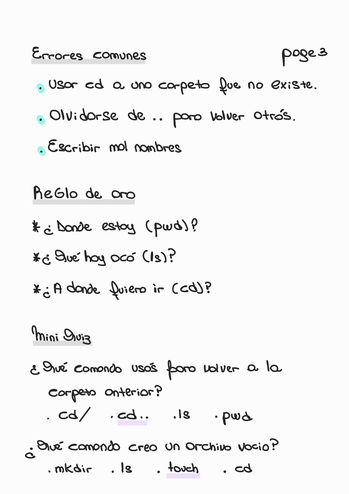
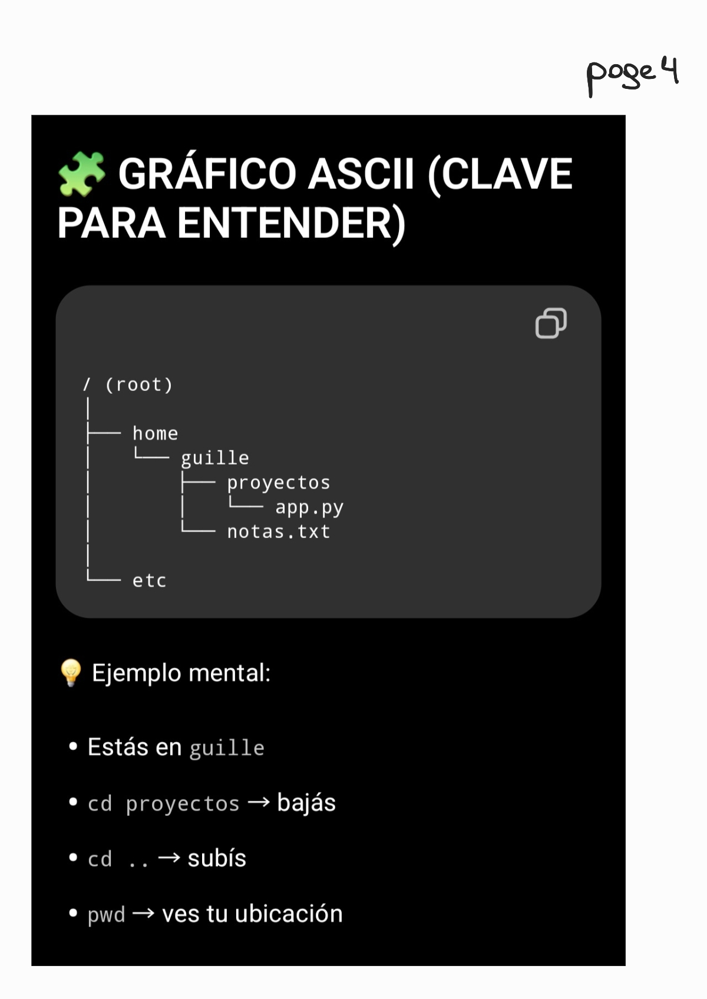

# 🖥️ Chapter 7 — Command Line Interface (CLI)

🏠 [Volver al repositorio principal](../../README.md)

⬅️ [Capítulo anterior — Functions](../chapter6_functions/README.md)

💻 [Ver ejemplos prácticos](../../code_examples/chapter7/README.md)

---

## ⚒️ Contenido del capítulo

- ¿Qué es la línea de comandos?
- ¿Qué es el filesystem?
- `ls`
- `pwd`
- `cd I`
- `cd II`
- `mkdir`
- `touch`
- Helper commands
- Review
- Quiz

---

## 🔹 CLI Navigation

### 🧠 Filesystem y comandos básicos

  

---

### 📂 Navegación y creación de archivos/carpetas

  

---

### ⚠️ Errores comunes + regla de oro + mini quiz

  

---

### 🧩 Estructura del filesystem (ASCII)

  

---
