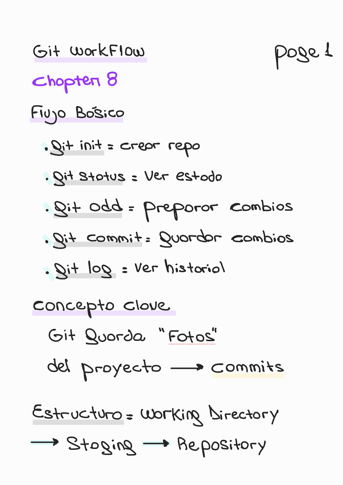
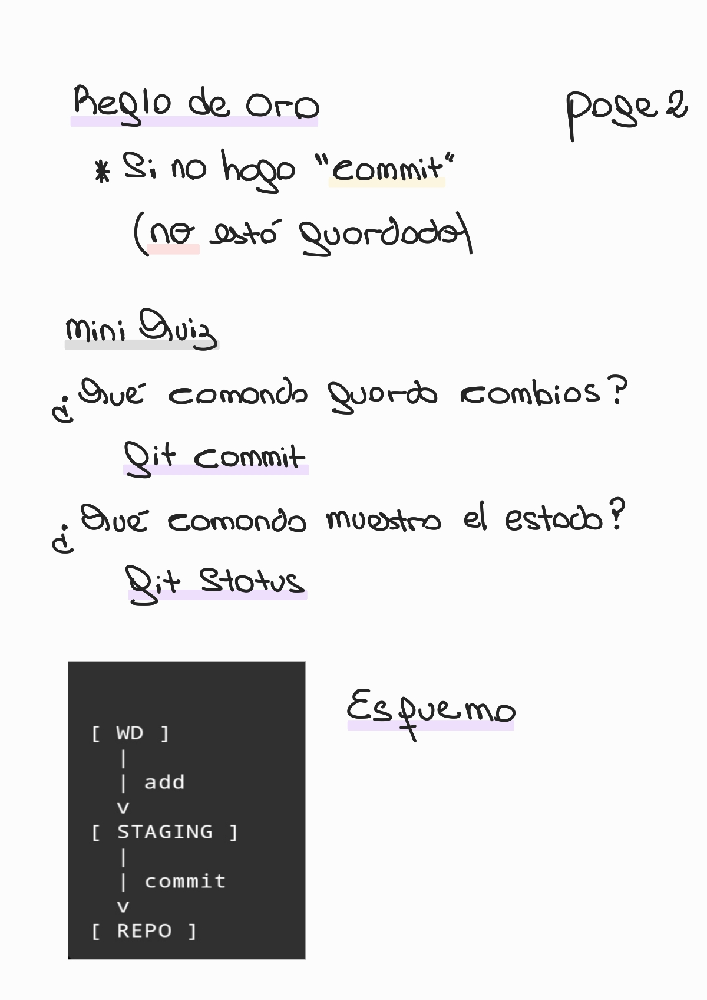

# Chapter 8 — Git & Version Control

🏠 [Volver al repositorio principal](../../README.md)

⬅️ [Capítulo anterior — Command Line Interface (CLI)](../chapter7_cli/README.md)

➡️ [Capítulo siguiente — String Methods](../chapter10_string_methods/README.md)

💻 [Ver ejemplos prácticos](../../code_examples/chapter8/README.md)

---

## 🛠️ Contenido del capítulo

- ¿Qué es Git?
- ¿Qué es version control?
- ¿Para qué sirve Git?
- Working Directory
- Staging Area
- Repository
- `git init`
- `git status`
- `git add`
- `git commit`
- `git log`
- Review
- Quiz

---

## 🔹 Git basics + workflow

  

---

## 🧠 Resumen + mini quiz

  

---
