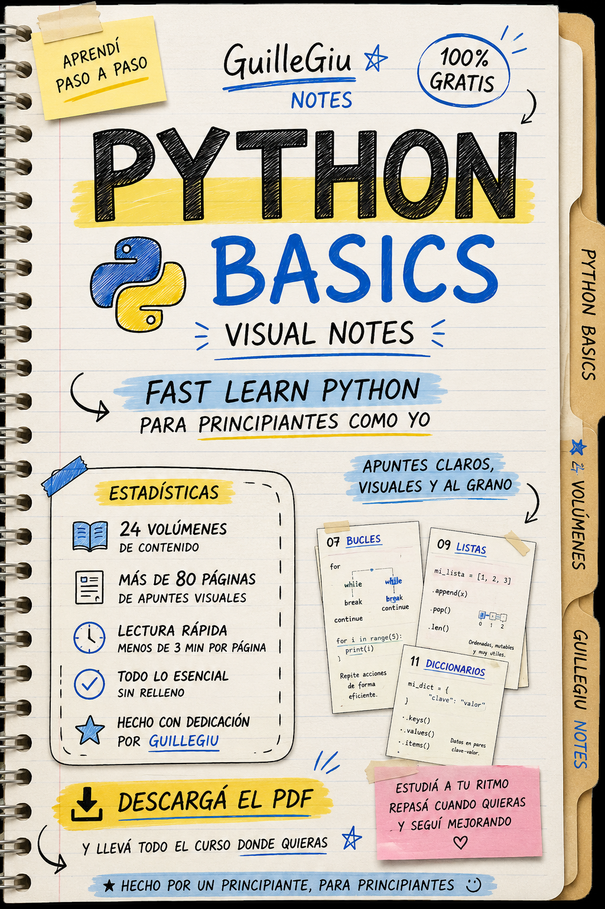

# 📚 Resources

> Colección de recursos descargables creados durante mi recorrido de aprendizaje como Software Engineer.

---

# 📖 eBooks

| Recurso | Estado | Descripción |
|:---------|:------:|:------------|
| 🐍 **GuilleGiu Notes – Python Básico** | ✅ | Visual Notes · 92 páginas · 24 volúmenes · 100% Gratis |
| 🗄️ **GuilleGiu Notes – SQL Quick Syntax** | 🚧 | Próximamente |
| 💻 **GuilleGiu Notes – Computer Science** | 🚧 | Próximamente |

---

  

<h2 align="center">
🐍 GuilleGiu Notes – Python Básico
</h2>

Visual Notes • 92 páginas • 24 volúmenes • 100% Gratis

## 📥 Descargar eBook

### **⬇️ [Descargar PDF](https://github.com/guillegiu/from-zero-to-software-engineer/releases/latest)**

---

## 📊 Estadísticas

| | |
|:---|:---:|
| 📖 Páginas | **92** |
| 📚 Volúmenes | **24** |
| 🐍 Contenido | **Python Fundamentals** |
| ✍️ Formato | **Visual Notes** |
| ⚡ Lectura | **Rápida y práctica** |
| 🎯 Nivel | **Principiante** |
| 🆓 Precio | **100% Gratis** |

---

## 🎨 Covers

- 🐍 Python Cover
- 🗄️ SQL Cover *(Próximamente)*
- 💻 Computer Science Cover *(Próximamente)*

---

## 📌 Objetivo

Estos recursos fueron creados para ayudar a cualquier persona que esté comenzando en programación.

Todo el contenido fue resumido y organizado por mí durante mi proceso de aprendizaje, buscando que sea claro, visual y fácil de consultar.

---

⭐ Si estos recursos te resultan útiles, podés dejar una estrella al repositorio.

---

<b>Designed & Summarized by GuilleGiu</b>

